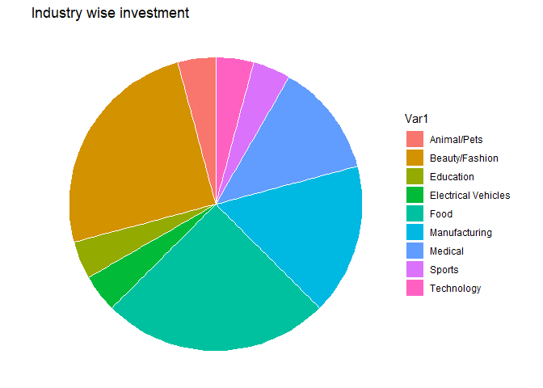
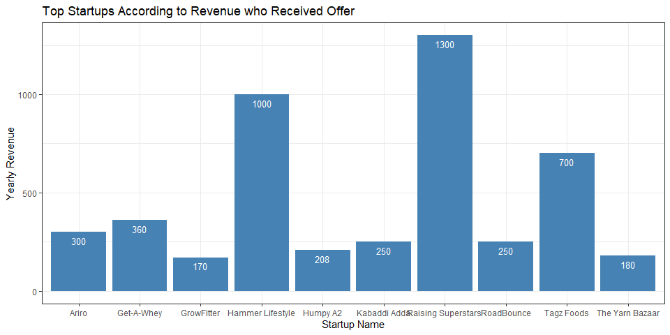

Shark-Tank-India-Data-Analysis
================
Sarwesh Khairnar
2022-06-10


# Dataset Link <https://www.kaggle.com/datasets/thirumani/shark-tank-india>

# Importing and Installing Required Libraries

``` r
#install.packages("plotrix")
#install.packages("lessR")
#install.packages("car")

#install.packages("wordcloud")
#install.packages("wordcloud2")
#install.packages("RColorBrewer")
#install.packages("tm")
library(tm)
```

    ## Warning: package 'tm' was built under R version 4.1.3

    ## Loading required package: NLP

``` r
library("plotrix")
library(lessR)
```

    ## Warning: package 'lessR' was built under R version 4.1.3

    ## 
    ## lessR 4.1.8                         feedback: gerbing@pdx.edu 
    ## --------------------------------------------------------------
    ## > d <- Read("")   Read text, Excel, SPSS, SAS, or R data file
    ##   d is default data frame, data= in analysis routines optional
    ## 
    ## Learn about reading, writing, and manipulating data, graphics,
    ## testing means and proportions, regression, factor analysis,
    ## customization, and descriptive statistics from pivot tables.
    ##   Enter:  browseVignettes("lessR")
    ## 
    ## View changes in this or recent versions of lessR.
    ##   Enter: help(package=lessR)  Click: Package NEWS
    ##   Enter: interact()  for access to interactive graphics
    ##   New function: reshape_long() to move data from wide to long

    ## 
    ## Attaching package: 'lessR'

    ## The following object is masked from 'package:plotrix':
    ## 
    ##     rescale

``` r
library("car")
```

    ## Loading required package: carData

    ## 
    ## Attaching package: 'car'

    ## The following objects are masked from 'package:lessR':
    ## 
    ##     bc, recode, sp

``` r
library(dplyr)
```

    ## 
    ## Attaching package: 'dplyr'

    ## The following object is masked from 'package:car':
    ## 
    ##     recode

    ## The following objects are masked from 'package:lessR':
    ## 
    ##     recode, rename

    ## The following objects are masked from 'package:stats':
    ## 
    ##     filter, lag

    ## The following objects are masked from 'package:base':
    ## 
    ##     intersect, setdiff, setequal, union

``` r
library(ggplot2)
```

    ## 
    ## Attaching package: 'ggplot2'

    ## The following object is masked from 'package:NLP':
    ## 
    ##     annotate

``` r
library(ggpubr)
library(wordcloud)
```

    ## Loading required package: RColorBrewer

``` r
library(RColorBrewer)
library(wordcloud2)
library(rmarkdown)
```

``` r
theme_set(theme_pubr())
```

# Importing the Dataset

``` r
data=read.csv("C:\\Users\\sarwe\\Desktop\\Tutorial\\SY\\SY-II\\DS\\Course Project\\Shark Tank India.csv")
```

# WordCloud

``` r
text <- c(data$Episode.Title, data$Startup.Name)
docs <- Corpus(VectorSource(text))
```

``` r
docs <- docs %>%
  tm_map(removeNumbers) %>%
  tm_map(removePunctuation) %>%
  tm_map(stripWhitespace)
docs <- tm_map(docs, content_transformer(tolower))
docs <- tm_map(docs, removeWords, stopwords("english"))
```

``` r
dtm <- TermDocumentMatrix(docs)
matrix <- as.matrix(dtm) 
words <- sort(rowSums(matrix),decreasing=TRUE) 
df <- data.frame(word = names(words),freq=words)
```

``` r
jpeg(file="wc.jpeg")
set.seed(2000) # for reproducibility 
wc <- wordcloud(words = df$word, freq = df$freq, min.freq = 1, max.words=300, random.order=FALSE, rot.per= 0.30, colors=brewer.pal(8, "Set1"), scale = c(5, 0.75))
dev.off()
```

    ## png 
    ##   2

<figure>

<figcaption aria-hidden="true">“”</figcaption>
</figure>

``` r
brewer.pal.info
```

    ##          maxcolors category colorblind
    ## BrBG            11      div       TRUE
    ## PiYG            11      div       TRUE
    ## PRGn            11      div       TRUE
    ## PuOr            11      div       TRUE
    ## RdBu            11      div       TRUE
    ## RdGy            11      div      FALSE
    ## RdYlBu          11      div       TRUE
    ## RdYlGn          11      div      FALSE
    ## Spectral        11      div      FALSE
    ## Accent           8     qual      FALSE
    ## Dark2            8     qual       TRUE
    ## Paired          12     qual       TRUE
    ## Pastel1          9     qual      FALSE
    ## Pastel2          8     qual      FALSE
    ## Set1             9     qual      FALSE
    ## Set2             8     qual       TRUE
    ## Set3            12     qual      FALSE
    ## Blues            9      seq       TRUE
    ## BuGn             9      seq       TRUE
    ## BuPu             9      seq       TRUE
    ## GnBu             9      seq       TRUE
    ## Greens           9      seq       TRUE
    ## Greys            9      seq       TRUE
    ## Oranges          9      seq       TRUE
    ## OrRd             9      seq       TRUE
    ## PuBu             9      seq       TRUE
    ## PuBuGn           9      seq       TRUE
    ## PuRd             9      seq       TRUE
    ## Purples          9      seq       TRUE
    ## RdPu             9      seq       TRUE
    ## Reds             9      seq       TRUE
    ## YlGn             9      seq       TRUE
    ## YlGnBu           9      seq       TRUE
    ## YlOrBr           9      seq       TRUE
    ## YlOrRd           9      seq       TRUE

# Understanding the Data

## Data Summary

``` r
head(data)
```

    ##   Season.Number Episode.Number               Episode.Title Pitch.Number
    ## 1             1              1 Badlegi Business Ki Tasveer            1
    ## 2             1              1 Badlegi Business Ki Tasveer            2
    ## 3             1              1 Badlegi Business Ki Tasveer            3
    ## 4             1              2     Insaan, Ideas Aur Sapne            4
    ## 5             1              2     Insaan, Ideas Aur Sapne            5
    ## 6             1              2     Insaan, Ideas Aur Sapne            6
    ##          Startup.Name            Industry
    ## 1      BluePine Foods                Food
    ## 2       Booz Scooters Electrical Vehicles
    ## 3 Heart up my Sleeves      Beauty/Fashion
    ## 4          Tagz Foods                Food
    ## 5      Head and Heart           Education
    ## 6        Agri tourism            Services
    ##                            Business.Description               Company.Website
    ## 1                                  Frozen Momos    https://bluepinefoods.com/
    ## 2 Renting e-bike for mobility in private spaces       https://www.boozup.net/
    ## 3                            Detachable Sleeves https://heartupmysleeves.com/
    ## 4                   Healthy Potato Chips Snacks        https://tagzfoods.com/
    ## 5                      Brain Development Course            https://thehnh.in/
    ## 6                                       Tourism   https://www.agritourism.in/
    ##   Number.of.Presenters Male.Presenters Female.Presenters Couple.Presenters
    ## 1                    3               2                 1                 0
    ## 2                    1               1                NA                 0
    ## 3                    1              NA                 1                 0
    ## 4                    2               2                NA                 0
    ## 5                    4               1                 3                 1
    ## 6                    2               1                 1                 1
    ##   Pitchers.Average.Age Started.in Pitchers.City Pitchers.State Yearly.Revenue
    ## 1               Middle       2016         Delhi          Delhi             95
    ## 2                Young       2017     Ahmedabad        Gujarat              4
    ## 3                Young       2021         Delhi          Delhi             NA
    ## 4               Middle       2019     Bangalore      Karnataka            700
    ## 5               Middle       2015                       Punjab             30
    ## 6               Middle       2005      Baramati    Maharashtra             79
    ##   Monthly.Sales Gross.Margin Original.Ask.Amount Original.Ask.Equity
    ## 1        800000           NA                  50                   5
    ## 2         40000           NA                  40                  15
    ## 3        200000           NA                  25                  10
    ## 4            NA           48                  70                   1
    ## 5            NA           NA                  50                   5
    ## 6            NA           NA                  50                   5
    ##   Valuation.Requested Received.Offer Accepted.Offer Total.Deal.Amount
    ## 1                1000              1              1                75
    ## 2                 267              1              1                40
    ## 3                 250              1              1                25
    ## 4                7000              1              1                70
    ## 5                1000              0             NA                NA
    ## 6                1000              0             NA                NA
    ##   Total.Deal.Equity Total.Deal.Debt Valuation.Offered Ashneer.Investment.Amount
    ## 1             16.00              NA               469                        25
    ## 2             50.00              NA                80                        20
    ## 3             30.00              NA                83                         0
    ## 4              2.75              NA              2545                        70
    ## 5                NA              NA                NA                        NA
    ## 6                NA              NA                NA                        NA
    ##   Ashneer.Investment.Equity Ashneer.Debt.Amount Namita.Investment.Amount
    ## 1                      5.33                  NA                        0
    ## 2                     25.00                  NA                        0
    ## 3                      0.00                  NA                        0
    ## 4                      2.75                  NA                        0
    ## 5                        NA                  NA                       NA
    ## 6                        NA                  NA                       NA
    ##   Namita.Investment.Equity Namita.Debt.Amount Anupam.Investment.Amount
    ## 1                        0                 NA                      0.0
    ## 2                        0                 NA                      0.0
    ## 3                        0                 NA                     12.5
    ## 4                        0                 NA                      0.0
    ## 5                       NA                 NA                       NA
    ## 6                       NA                 NA                       NA
    ##   Anupam.Investment.Equity Anupam.Debt.Amount Vineeta.Investment.Amount
    ## 1                        0                 NA                      25.0
    ## 2                        0                 NA                      20.0
    ## 3                       15                 NA                      12.5
    ## 4                        0                 NA                       0.0
    ## 5                       NA                 NA                        NA
    ## 6                       NA                 NA                        NA
    ##   Vineeta.Investment.Equity Vineeta.Debt.Amount Aman.Investment.Amount
    ## 1                      5.33                  NA                     25
    ## 2                     25.00                  NA                      0
    ## 3                     15.00                  NA                      0
    ## 4                      0.00                  NA                      0
    ## 5                        NA                  NA                     NA
    ## 6                        NA                  NA                     NA
    ##   Aman.Investment.Equity Aman.Debt.Amount Peyush.Investment.Amount
    ## 1                   5.33               NA                       NA
    ## 2                   0.00               NA                       NA
    ## 3                   0.00               NA                       NA
    ## 4                   0.00               NA                       NA
    ## 5                     NA               NA                       NA
    ## 6                     NA               NA                       NA
    ##   Peyush.Investment.Equity Peyush.Debt.Amount Ghazal.Investment.Amount
    ## 1                       NA                 NA                       NA
    ## 2                       NA                 NA                       NA
    ## 3                       NA                 NA                       NA
    ## 4                       NA                 NA                       NA
    ## 5                       NA                 NA                       NA
    ## 6                       NA                 NA                       NA
    ##   Ghazal.Investment.Equity Ghazal.Debt.Amount Number.of.sharks.in.deal
    ## 1                       NA                 NA                        3
    ## 2                       NA                 NA                        2
    ## 3                       NA                 NA                        2
    ## 4                       NA                 NA                        1
    ## 5                       NA                 NA                       NA
    ## 6                       NA                 NA                       NA

``` r
dim(data)
```

    ## [1] 121  50

``` r
tail(data)
```

    ##     Season.Number Episode.Number               Episode.Title Pitch.Number
    ## 116             1             35       The Final Destination          116
    ## 117             1             35       The Final Destination          117
    ## 118             1             36 Gateway To Shark Tank India          118
    ## 119             1             36 Gateway To Shark Tank India          119
    ## 120             1             36 Gateway To Shark Tank India          120
    ## 121             1             36 Gateway To Shark Tank India          121
    ##       Startup.Name       Industry             Business.Description
    ## 116          Woloo     Technology                  Washroom Finder
    ## 117   Elcare India        Medical             Carenting for Elders
    ## 118       SneaKare Beauty/Fashion Shoe Sneaker kits storage crates
    ## 119   French Crown Beauty/Fashion                          Clothes
    ## 120 Store My Goods       Services                Storage solutions
    ## 121       Devnagri     Technology  Translation of language content
    ##              Company.Website Number.of.Presenters Male.Presenters
    ## 116        https://woloo.in/                    3               1
    ## 117       https://elcare.co/                    3               2
    ## 118    https://sneakare.com/                    1               1
    ## 119  https://frenchcrown.in/                    2               2
    ## 120 https://storemygoods.in/                    3               2
    ## 121    https://devnagri.com/                    2               2
    ##     Female.Presenters Couple.Presenters Pitchers.Average.Age Started.in
    ## 116                 2                 0               Middle       2020
    ## 117                 1                 0               Middle       2021
    ## 118                NA                 0                Young       2020
    ## 119                NA                 0               Middle       2017
    ## 120                 1                 1               Middle       2020
    ## 121                NA                 0               Middle       2020
    ##     Pitchers.City Pitchers.State Yearly.Revenue Monthly.Sales Gross.Margin
    ## 116                                         108            NA           NA
    ## 117        Mumbai    Maharashtra             60            NA           30
    ## 118         Delhi          Delhi             NA        700000           NA
    ## 119         Surat        Gujarat           7200            NA           70
    ## 120         Noida  Uttar Pradesh            100            NA           NA
    ## 121         Delhi          Delhi            500            NA           NA
    ##     Original.Ask.Amount Original.Ask.Equity Valuation.Requested Received.Offer
    ## 116                  50                4.00                1250              1
    ## 117                 100                2.50                4000              0
    ## 118                  20                5.00                 400              1
    ## 119                 150                0.33               45455              1
    ## 120                 100                1.75                5714              1
    ## 121                 100                1.00               10000              1
    ##     Accepted.Offer Total.Deal.Amount Total.Deal.Equity Total.Deal.Debt
    ## 116              0                NA                NA              NA
    ## 117             NA                NA                NA              NA
    ## 118              1                21                12              NA
    ## 119              0                NA                NA              NA
    ## 120              1                50                 4              50
    ## 121              0                NA                NA              NA
    ##     Valuation.Offered Ashneer.Investment.Amount Ashneer.Investment.Equity
    ## 116                NA                        NA                        NA
    ## 117                NA                        NA                        NA
    ## 118               175                        NA                        NA
    ## 119                NA                        NA                        NA
    ## 120              1250                        NA                        NA
    ## 121                NA                        NA                        NA
    ##     Ashneer.Debt.Amount Namita.Investment.Amount Namita.Investment.Equity
    ## 116                  NA                       NA                       NA
    ## 117                  NA                       NA                       NA
    ## 118                  NA                        7                        4
    ## 119                  NA                       NA                       NA
    ## 120                  NA                       25                        2
    ## 121                  NA                       NA                       NA
    ##     Namita.Debt.Amount Anupam.Investment.Amount Anupam.Investment.Equity
    ## 116                 NA                       NA                       NA
    ## 117                 NA                       NA                       NA
    ## 118                 NA                        0                        0
    ## 119                 NA                       NA                       NA
    ## 120                 25                        0                        0
    ## 121                 NA                       NA                       NA
    ##     Anupam.Debt.Amount Vineeta.Investment.Amount Vineeta.Investment.Equity
    ## 116                 NA                        NA                        NA
    ## 117                 NA                        NA                        NA
    ## 118                 NA                         7                         4
    ## 119                 NA                        NA                        NA
    ## 120                 NA                         0                         0
    ## 121                 NA                        NA                        NA
    ##     Vineeta.Debt.Amount Aman.Investment.Amount Aman.Investment.Equity
    ## 116                  NA                     NA                     NA
    ## 117                  NA                     NA                     NA
    ## 118                  NA                      7                      4
    ## 119                  NA                     NA                     NA
    ## 120                  NA                      0                      0
    ## 121                  NA                     NA                     NA
    ##     Aman.Debt.Amount Peyush.Investment.Amount Peyush.Investment.Equity
    ## 116               NA                       NA                       NA
    ## 117               NA                       NA                       NA
    ## 118               NA                        0                        0
    ## 119               NA                       NA                       NA
    ## 120               NA                       25                        2
    ## 121               NA                       NA                       NA
    ##     Peyush.Debt.Amount Ghazal.Investment.Amount Ghazal.Investment.Equity
    ## 116                 NA                       NA                       NA
    ## 117                 NA                       NA                       NA
    ## 118                 NA                       NA                       NA
    ## 119                 NA                       NA                       NA
    ## 120                 25                       NA                       NA
    ## 121                 NA                       NA                       NA
    ##     Ghazal.Debt.Amount Number.of.sharks.in.deal
    ## 116                 NA                       NA
    ## 117                 NA                       NA
    ## 118                 NA                        3
    ## 119                 NA                       NA
    ## 120                 NA                        2
    ## 121                 NA                       NA

``` r
summary(data)
```

    ##  Season.Number Episode.Number  Episode.Title       Pitch.Number
    ##  Min.   :1     Min.   : 1.00   Length:121         Min.   :  1  
    ##  1st Qu.:1     1st Qu.:11.00   Class :character   1st Qu.: 31  
    ##  Median :1     Median :19.00   Mode  :character   Median : 61  
    ##  Mean   :1     Mean   :19.31                      Mean   : 61  
    ##  3rd Qu.:1     3rd Qu.:28.00                      3rd Qu.: 91  
    ##  Max.   :1     Max.   :36.00                      Max.   :121  
    ##                                                                
    ##  Startup.Name         Industry         Business.Description Company.Website   
    ##  Length:121         Length:121         Length:121           Length:121        
    ##  Class :character   Class :character   Class :character     Class :character  
    ##  Mode  :character   Mode  :character   Mode  :character     Mode  :character  
    ##                                                                               
    ##                                                                               
    ##                                                                               
    ##                                                                               
    ##  Number.of.Presenters Male.Presenters Female.Presenters Couple.Presenters
    ##  Min.   :1.000        Min.   :1.000   Min.   :1.00      Min.   :0.0000   
    ##  1st Qu.:1.000        1st Qu.:1.000   1st Qu.:1.00      1st Qu.:0.0000   
    ##  Median :2.000        Median :1.000   Median :1.00      Median :0.0000   
    ##  Mean   :2.083        Mean   :1.735   Mean   :1.21      Mean   :0.2083   
    ##  3rd Qu.:3.000        3rd Qu.:2.000   3rd Qu.:1.00      3rd Qu.:0.0000   
    ##  Max.   :6.000        Max.   :6.000   Max.   :3.00      Max.   :1.0000   
    ##                       NA's   :19      NA's   :59        NA's   :1        
    ##  Pitchers.Average.Age   Started.in   Pitchers.City      Pitchers.State    
    ##  Length:121           Min.   :2005   Length:121         Length:121        
    ##  Class :character     1st Qu.:2017   Class :character   Class :character  
    ##  Mode  :character     Median :2019   Mode  :character   Mode  :character  
    ##                       Mean   :2018                                        
    ##                       3rd Qu.:2020                                        
    ##                       Max.   :2022                                        
    ##                       NA's   :26                                          
    ##  Yearly.Revenue    Monthly.Sales       Gross.Margin    Original.Ask.Amount
    ##  Min.   :   0.00   Min.   :       0   Min.   :  3.00   Min.   :    0.0    
    ##  1st Qu.:  53.75   1st Qu.:  200000   1st Qu.: 30.00   1st Qu.:   45.0    
    ##  Median : 112.50   Median :  550000   Median : 50.00   Median :   50.0    
    ##  Mean   : 405.13   Mean   : 1455049   Mean   : 53.74   Mean   :  312.6    
    ##  3rd Qu.: 255.50   3rd Qu.: 1600000   3rd Qu.: 70.00   3rd Qu.:   80.0    
    ##  Max.   :7200.00   Max.   :20000000   Max.   :150.00   Max.   :30000.0    
    ##  NA's   :69        NA's   :56         NA's   :86                          
    ##  Original.Ask.Equity Valuation.Requested Received.Offer   Accepted.Offer  
    ##  Min.   : 0.25       Min.   :     0      Min.   :0.0000   Min.   :0.0000  
    ##  1st Qu.: 2.00       1st Qu.:   667      1st Qu.:0.0000   1st Qu.:1.0000  
    ##  Median : 4.00       Median :  1500      Median :1.0000   Median :1.0000  
    ##  Mean   : 4.86       Mean   :  4415      Mean   :0.7273   Mean   :0.7614  
    ##  3rd Qu.: 7.00       3rd Qu.:  3250      3rd Qu.:1.0000   3rd Qu.:1.0000  
    ##  Max.   :25.00       Max.   :120000      Max.   :1.0000   Max.   :1.0000  
    ##                                                           NA's   :33      
    ##  Total.Deal.Amount   Total.Deal.Equity Total.Deal.Debt Valuation.Offered
    ##  Min.   :  0.00005   Min.   : 1.00     Min.   :20      Min.   :   0.0   
    ##  1st Qu.: 40.00000   1st Qu.: 5.50     1st Qu.:25      1st Qu.: 163.5   
    ##  Median : 50.00000   Median :15.00     Median :30      Median : 500.0   
    ##  Mean   : 58.25375   Mean   :15.89     Mean   :39      Mean   : 850.4   
    ##  3rd Qu.: 75.00000   3rd Qu.:20.50     3rd Qu.:50      3rd Qu.:1125.0   
    ##  Max.   :150.00000   Max.   :75.00     Max.   :99      Max.   :6667.0   
    ##  NA's   :54          NA's   :54        NA's   :112     NA's   :54       
    ##  Ashneer.Investment.Amount Ashneer.Investment.Equity Ashneer.Debt.Amount
    ##  Min.   : 0.000            Min.   : 0.000            Min.   :15         
    ##  1st Qu.: 0.000            1st Qu.: 0.000            1st Qu.:36         
    ##  Median : 0.000            Median : 0.000            Median :57         
    ##  Mean   : 9.988            Mean   : 1.727            Mean   :57         
    ##  3rd Qu.:20.000            3rd Qu.: 2.375            3rd Qu.:78         
    ##  Max.   :70.000            Max.   :25.000            Max.   :99         
    ##  NA's   :67                NA's   :67                NA's   :119        
    ##  Namita.Investment.Amount Namita.Investment.Equity Namita.Debt.Amount
    ##  Min.   : 0.00            Min.   : 0.000           Min.   :25        
    ##  1st Qu.: 0.00            1st Qu.: 0.000           1st Qu.:25        
    ##  Median : 0.00            Median : 0.000           Median :25        
    ##  Mean   :10.97            Mean   : 2.271           Mean   :25        
    ##  3rd Qu.:18.75            3rd Qu.: 3.000           3rd Qu.:25        
    ##  Max.   :75.00            Max.   :25.000           Max.   :25        
    ##  NA's   :59               NA's   :59               NA's   :120       
    ##  Anupam.Investment.Amount Anupam.Investment.Equity Anupam.Debt.Amount
    ##  Min.   : 0.000           Min.   : 0.000           Min.   :15        
    ##  1st Qu.: 0.000           1st Qu.: 0.000           1st Qu.:15        
    ##  Median : 0.000           Median : 0.000           Median :15        
    ##  Mean   : 7.968           Mean   : 2.483           Mean   :15        
    ##  3rd Qu.:15.415           3rd Qu.: 1.875           3rd Qu.:15        
    ##  Max.   :50.000           Max.   :17.500           Max.   :15        
    ##  NA's   :54               NA's   :54               NA's   :120       
    ##  Vineeta.Investment.Amount Vineeta.Investment.Equity Vineeta.Debt.Amount
    ##  Min.   : 0.000            Min.   : 0.000            Min.   :30         
    ##  1st Qu.: 0.000            1st Qu.: 0.000            1st Qu.:30         
    ##  Median : 0.000            Median : 0.000            Median :30         
    ##  Mean   : 9.862            Mean   : 3.986            Mean   :30         
    ##  3rd Qu.:20.000            3rd Qu.: 5.247            3rd Qu.:30         
    ##  Max.   :40.000            Max.   :25.000            Max.   :30         
    ##  NA's   :87                NA's   :87                NA's   :120        
    ##  Aman.Investment.Amount Aman.Investment.Equity Aman.Debt.Amount
    ##  Min.   :  0.00         Min.   : 0.000         Min.   :50      
    ##  1st Qu.:  0.00         1st Qu.: 0.000         1st Qu.:50      
    ##  Median :  3.50         Median : 0.875         Median :50      
    ##  Mean   : 15.97         Mean   : 2.933         Mean   :50      
    ##  3rd Qu.: 25.00         3rd Qu.: 4.250         3rd Qu.:50      
    ##  Max.   :100.00         Max.   :40.000         Max.   :50      
    ##  NA's   :65             NA's   :65             NA's   :120     
    ##  Peyush.Investment.Amount Peyush.Investment.Equity Peyush.Debt.Amount
    ##  Min.   :  0.00           Min.   : 0.000           Min.   :20.0      
    ##  1st Qu.:  0.00           1st Qu.: 0.000           1st Qu.:22.0      
    ##  Median :  8.33           Median : 1.000           Median :25.0      
    ##  Mean   : 14.90           Mean   : 5.997           Mean   :23.4      
    ##  3rd Qu.: 25.00           3rd Qu.: 5.000           3rd Qu.:25.0      
    ##  Max.   :100.00           Max.   :75.000           Max.   :25.0      
    ##  NA's   :68               NA's   :68               NA's   :116       
    ##  Ghazal.Investment.Amount Ghazal.Investment.Equity Ghazal.Debt.Amount
    ##  Min.   : 0.00000         Min.   : 0.000           Mode:logical      
    ##  1st Qu.: 0.00000         1st Qu.: 0.000           NA's:121          
    ##  Median : 0.00025         Median : 1.000                             
    ##  Mean   : 9.99925         Mean   : 3.592                             
    ##  3rd Qu.:20.00000         3rd Qu.: 5.000                             
    ##  Max.   :33.33000         Max.   :17.500                             
    ##  NA's   :108              NA's   :108                                
    ##  Number.of.sharks.in.deal
    ##  Min.   :1.000           
    ##  1st Qu.:1.000           
    ##  Median :2.000           
    ##  Mean   :2.224           
    ##  3rd Qu.:3.000           
    ##  Max.   :5.000           
    ##  NA's   :54

## Removing Insignificant Column

``` r
colnames(data)
```

    ##  [1] "Season.Number"             "Episode.Number"           
    ##  [3] "Episode.Title"             "Pitch.Number"             
    ##  [5] "Startup.Name"              "Industry"                 
    ##  [7] "Business.Description"      "Company.Website"          
    ##  [9] "Number.of.Presenters"      "Male.Presenters"          
    ## [11] "Female.Presenters"         "Couple.Presenters"        
    ## [13] "Pitchers.Average.Age"      "Started.in"               
    ## [15] "Pitchers.City"             "Pitchers.State"           
    ## [17] "Yearly.Revenue"            "Monthly.Sales"            
    ## [19] "Gross.Margin"              "Original.Ask.Amount"      
    ## [21] "Original.Ask.Equity"       "Valuation.Requested"      
    ## [23] "Received.Offer"            "Accepted.Offer"           
    ## [25] "Total.Deal.Amount"         "Total.Deal.Equity"        
    ## [27] "Total.Deal.Debt"           "Valuation.Offered"        
    ## [29] "Ashneer.Investment.Amount" "Ashneer.Investment.Equity"
    ## [31] "Ashneer.Debt.Amount"       "Namita.Investment.Amount" 
    ## [33] "Namita.Investment.Equity"  "Namita.Debt.Amount"       
    ## [35] "Anupam.Investment.Amount"  "Anupam.Investment.Equity" 
    ## [37] "Anupam.Debt.Amount"        "Vineeta.Investment.Amount"
    ## [39] "Vineeta.Investment.Equity" "Vineeta.Debt.Amount"      
    ## [41] "Aman.Investment.Amount"    "Aman.Investment.Equity"   
    ## [43] "Aman.Debt.Amount"          "Peyush.Investment.Amount" 
    ## [45] "Peyush.Investment.Equity"  "Peyush.Debt.Amount"       
    ## [47] "Ghazal.Investment.Amount"  "Ghazal.Investment.Equity" 
    ## [49] "Ghazal.Debt.Amount"        "Number.of.sharks.in.deal"

``` r
data <- data[, -c(1)]
print("--------------------------------------------------------------------------------")
```

    ## [1] "--------------------------------------------------------------------------------"

``` r
print("After removing Column")
```

    ## [1] "After removing Column"

``` r
print("--------------------------------------------------------------------------------")
```

    ## [1] "--------------------------------------------------------------------------------"

``` r
colnames(data)
```

    ##  [1] "Episode.Number"            "Episode.Title"            
    ##  [3] "Pitch.Number"              "Startup.Name"             
    ##  [5] "Industry"                  "Business.Description"     
    ##  [7] "Company.Website"           "Number.of.Presenters"     
    ##  [9] "Male.Presenters"           "Female.Presenters"        
    ## [11] "Couple.Presenters"         "Pitchers.Average.Age"     
    ## [13] "Started.in"                "Pitchers.City"            
    ## [15] "Pitchers.State"            "Yearly.Revenue"           
    ## [17] "Monthly.Sales"             "Gross.Margin"             
    ## [19] "Original.Ask.Amount"       "Original.Ask.Equity"      
    ## [21] "Valuation.Requested"       "Received.Offer"           
    ## [23] "Accepted.Offer"            "Total.Deal.Amount"        
    ## [25] "Total.Deal.Equity"         "Total.Deal.Debt"          
    ## [27] "Valuation.Offered"         "Ashneer.Investment.Amount"
    ## [29] "Ashneer.Investment.Equity" "Ashneer.Debt.Amount"      
    ## [31] "Namita.Investment.Amount"  "Namita.Investment.Equity" 
    ## [33] "Namita.Debt.Amount"        "Anupam.Investment.Amount" 
    ## [35] "Anupam.Investment.Equity"  "Anupam.Debt.Amount"       
    ## [37] "Vineeta.Investment.Amount" "Vineeta.Investment.Equity"
    ## [39] "Vineeta.Debt.Amount"       "Aman.Investment.Amount"   
    ## [41] "Aman.Investment.Equity"    "Aman.Debt.Amount"         
    ## [43] "Peyush.Investment.Amount"  "Peyush.Investment.Equity" 
    ## [45] "Peyush.Debt.Amount"        "Ghazal.Investment.Amount" 
    ## [47] "Ghazal.Investment.Equity"  "Ghazal.Debt.Amount"       
    ## [49] "Number.of.sharks.in.deal"

``` r
#barplot(table(data$Industry))
pitches <- table(data$Industry)
pitches
```

    ## 
    ##         Animal/Pets      Beauty/Fashion           Education Electrical Vehicles 
    ##                   3                  22                   8                   4 
    ##                Food            Hardware       Manufacturing             Medical 
    ##                  37                   3                  17                   7 
    ##            Services              Sports          Technology 
    ##                   7                   2                  11

## Number of Pitches according to Industry

``` r
plt <- barplot(as.numeric(pitches),
main = "Number of Pitches per Industry",
xlab = "Industries",
ylab = "Number of Pitches",
col = "darkred",
horiz = FALSE)
axis(1, at = plt, labels=names(pitches), cex.axis=0.4)
```


## Presenters Data

``` r
male_presenters <- sum(data$Male.Presenters,na.rm = TRUE)
female_presenters <- sum(data$Female.Presenters, na.rm = TRUE)
couple_presenters <- sum(data$Couple.Presenters, na.rm = TRUE)

barplot(c(male_presenters, female_presenters, couple_presenters),
        names.arg = c("Male", "Female", "Couples"),
        xlab = "Presenters",
        ylab = "Number of Pitches",
        col = "yellow",
        horiz = TRUE)
```


``` r
pie3D(c(male_presenters, female_presenters), labels = c("Male", "Female"), main = "Male vs Female Entreprenuers", explode = 0.1,col = c("yellow","skyblue"))
```


## Received Offers

``` r
PieChart(Received.Offer,hole = 0, values = "%", data = data,main = "Received and Not Received", fill = c("red", "green"))
```


    ## >>> Suggestions
    ## PieChart(Received.Offer, hole=0)  # traditional pie chart
    ## PieChart(Received.Offer, values="%")  # display %'s on the chart
    ## PieChart(Received.Offer)  # bar chart
    ## Plot(Received.Offer)  # bubble plot
    ## Plot(Received.Offer, values="count")  # lollipop plot 
    ## 
    ## --- Received.Offer --- 
    ## 
    ##                    0      1     Total 
    ## Frequencies:      33     88       121 
    ## Proportions:   0.273  0.727     1.000 
    ## 
    ## Chi-squared test of null hypothesis of equal probabilities 
    ##   Chisq = 25.000, df = 1, p-value = 0.000

``` r
PieChart(Accepted.Offer,hole = 0, values = "%", data = data,main = "Accepted the Received Offer", fill = c("red", "green"))
```


    ## >>> Suggestions
    ## PieChart(Accepted.Offer, hole=0)  # traditional pie chart
    ## PieChart(Accepted.Offer, values="%")  # display %'s on the chart
    ## PieChart(Accepted.Offer)  # bar chart
    ## Plot(Accepted.Offer)  # bubble plot
    ## Plot(Accepted.Offer, values="count")  # lollipop plot 
    ## 
    ## --- Accepted.Offer --- 
    ## 
    ##                    0      1    Total 
    ## Frequencies:      21     67       88 
    ## Proportions:   0.239  0.761    1.000 
    ## 
    ## Chi-squared test of null hypothesis of equal probabilities 
    ##   Chisq = 24.045, df = 1, p-value = 0.000

## Rejected Offers

``` r
rejected_offers <- data.frame(data[data$Accepted.Offer == 0,c("Startup.Name", "Industry", "Original.Ask.Amount", "Original.Ask.Equity")])
rejected_offers <- na.exclude(rejected_offers)
rejected_offers
```

    ##            Startup.Name       Industry Original.Ask.Amount Original.Ask.Equity
    ## 7           qZense Labs           Food                 100                0.25
    ## 20             Torch-it      Education                  75                1.00
    ## 21        La Kheer Deli           Food                  50                7.50
    ## 27       Kabira Handmad           Food                 100                5.00
    ## 41   Morriko Pure Foods           Food                 100                3.00
    ## 55    India Hemp and Co           Food                  50                4.00
    ## 60           Keto India           Food                 150                1.25
    ## 70            Moonshine           Food                  80                0.50
    ## 71              Falhari           Food                  50                2.00
    ## 73         Urban Monkey Beauty/Fashion                 100                1.00
    ## 74       Guardian Gears  Manufacturing                  30                5.00
    ## 81               Alpino           Food                 150                2.00
    ## 87  Aliste Technologies     Technology                  60                5.00
    ## 93           PDD Falcon  Manufacturing                  75                3.00
    ## 94            PlayBoxTV       Services                 100                3.50
    ## 104      ExperentialEtc     Technology                 200                4.00
    ## 106         C3 Med-Tech        Medical                  35                6.00
    ## 113       Green Protein           Food                  60                2.00
    ## 116               Woloo     Technology                  50                4.00
    ## 119        French Crown Beauty/Fashion                 150                0.33
    ## 121            Devnagri     Technology                 100                1.00

``` r
rejected_offers_Industry <- data.frame(data[data$Accepted.Offer == 0,c("Industry")])
rejected_offers_Industry_count <- data.frame(table(rejected_offers_Industry))
rejected_offers_Industry_count
```

    ##   rejected_offers_Industry Freq
    ## 1           Beauty/Fashion    2
    ## 2                Education    1
    ## 3                     Food   10
    ## 4            Manufacturing    2
    ## 5                  Medical    1
    ## 6                 Services    1
    ## 7               Technology    4

``` r
p<-ggplot(data=rejected_offers_Industry_count, aes(x=rejected_offers_Industry, y=Freq)) +
  geom_bar(stat="identity", fill="steelblue")+
  geom_text(aes(label=Freq), vjust=1.6, color="white", size=3.5)+
  theme_bw()+xlab("Rejected offeres according to industry")+ylab("Rejected Offers")
p
```


## Collecting Sharks data

``` r
ashneer <- data[(!is.na(data$Ashneer.Investment.Amount) & data$Ashneer.Investment.Amount != 0 ),c("Startup.Name","Ashneer.Investment.Amount","Ashneer.Investment.Equity","Industry","Number.of.sharks.in.deal")]
namita <- data[!is.na(data$Namita.Investment.Amount) & data$Namita.Investment.Amount != 0 ,c("Startup.Name","Namita.Investment.Amount","Namita.Investment.Equity", "Industry","Number.of.sharks.in.deal")]
anupam <- data[!is.na(data$Anupam.Investment.Amount) & data$Anupam.Investment.Amount != 0 ,c("Startup.Name","Anupam.Investment.Amount","Anupam.Investment.Equity", "Industry", "Number.of.sharks.in.deal")]
vineeta <- data[!is.na(data$Vineeta.Investment.Amount) & data$Vineeta.Investment.Amount != 0 ,c("Startup.Name","Vineeta.Investment.Amount","Vineeta.Investment.Equity", "Industry", "Number.of.sharks.in.deal")]
aman <- data[!is.na(data$Aman.Investment.Amount) & data$Aman.Investment.Amount != 0 ,c("Startup.Name","Aman.Investment.Amount","Aman.Investment.Equity", "Industry","Number.of.sharks.in.deal")]
peyush <- data[!is.na(data$Peyush.Investment.Amount) & data$Peyush.Investment.Amount != 0 ,c("Startup.Name","Peyush.Investment.Amount","Peyush.Investment.Equity", "Industry", "Number.of.sharks.in.deal")]
ghazal <- data[!is.na(data$Ghazal.Investment.Amount) & data$Ghazal.Investment.Amount != 0 ,c("Startup.Name","Ghazal.Investment.Amount","Ghazal.Investment.Equity", "Industry", "Number.of.sharks.in.deal")]
```

## Investment Done by Sharks

``` r
sharks <- c("Ashneer", "Namita", "Anupam", "Vineeta", "Aman", "Peyush", "Ghazal")
all <- data.frame(Sharks = sharks,Investments = c(length(ashneer$Ashneer.Investment.Amount), length(namita$Namita.Investment.Amount), length(anupam$Anupam.Investment.Amount), length(vineeta$Vineeta.Investment.Amount), length(aman$Aman.Investment.Amount), length(peyush$Peyush.Investment.Amount), length(ghazal$Ghazal.Investment.Amount)))
all
```

    ##    Sharks Investments
    ## 1 Ashneer          21
    ## 2  Namita          24
    ## 3  Anupam          24
    ## 4 Vineeta          16
    ## 5    Aman          29
    ## 6  Peyush          28
    ## 7  Ghazal           7

``` r
p<-ggplot(data=all, aes(x=Sharks, y=Investments)) +
  geom_bar(stat="identity", fill="steelblue")+
  geom_text(aes(label=all$Investments), vjust=1.6, color="white", size=3.5)+
  theme_bw()
p
```


## Amount Invested

``` r
startup_count <- c(sum(ashneer$Ashneer.Investment.Amount),  sum(namita$Namita.Investment.Amount), sum(anupam$Anupam.Investment.Amount), sum(vineeta$Vineeta.Investment.Amount), sum(aman$Aman.Investment.Amount), sum(peyush$Peyush.Investment.Amount),sum(ghazal$Ghazal.Investment.Amount))
startup_count <- round(startup_count,2)
startup_count <- data.frame(Sharks = sharks, Count = startup_count)
startup_count
```

    ##    Sharks  Count
    ## 1 Ashneer 539.33
    ## 2  Namita 680.33
    ## 3  Anupam 533.83
    ## 4 Vineeta 335.32
    ## 5    Aman 894.49
    ## 6  Peyush 789.65
    ## 7  Ghazal 129.99

``` r
p<-ggplot(data=startup_count, aes(x=Sharks, y=Count)) +
  geom_bar(stat="identity", fill="steelblue")+
  geom_text(aes(label=Count), vjust=1.6, color="white", size=3.5)+theme_bw()+ylab("Amount")
p
```


## Equity Invested

``` r
ashneer_equity <- sum(data[!is.na(data$Ashneer.Investment.Equity) & data$Ashneer.Investment.Equity != 0 ,"Ashneer.Investment.Equity"])
namita_equity <- sum(data[!is.na(data$Namita.Investment.Equity) & data$Namita.Investment.Equity != 0 ,"Namita.Investment.Equity"])
anupam_equity <- sum(data[!is.na(data$Anupam.Investment.Equity) & data$Anupam.Investment.Equity != 0 ,"Anupam.Investment.Equity"])
vineeta_equity <- sum(data[!is.na(data$Vineeta.Investment.Equity) & data$Vineeta.Investment.Equity != 0 ,"Vineeta.Investment.Equity"])
aman_equity <- sum(data[!is.na(data$Aman.Investment.Equity) & data$Aman.Investment.Equity != 0 ,"Aman.Investment.Equity"])
peyush_equity <- sum(data[!is.na(data$Peyush.Investment.Equity) & data$Peyush.Investment.Equity != 0 ,"Peyush.Investment.Equity"])
ghazal_equity <- sum(data[!is.na(data$Ghazal.Investment.Equity) & data$Ghazal.Investment.Equity != 0 ,"Ghazal.Investment.Equity"])

equity <- data.frame(Sharks=sharks, Equity=c(ashneer_equity, namita_equity, anupam_equity, vineeta_equity, aman_equity, peyush_equity, ghazal_equity))
equity
```

    ##    Sharks  Equity
    ## 1 Ashneer  93.240
    ## 2  Namita 140.776
    ## 3  Anupam 166.346
    ## 4 Vineeta 135.530
    ## 5    Aman 164.246
    ## 6  Peyush 317.840
    ## 7  Ghazal  46.700

``` r
p<-ggplot(data=equity, aes(x=Sharks, y=Equity)) +
  geom_bar(stat="identity", fill="steelblue")+
  geom_text(aes(label=Equity), vjust=1.6, color="white", size=3.5)+theme_bw()
p
```


## Debt Given

``` r
ashneer_debt <- sum(data[!is.na(data$Ashneer.Debt.Amount) & data$Ashneer.Debt.Amount != 0 ,"Ashneer.Debt.Amount"])
namita_debt <- sum(data[!is.na(data$Namita.Debt.Amount) & data$Namita.Debt.Amount != 0 ,"Namita.Debt.Amount"])
anupam_debt <- sum(data[!is.na(data$Anupam.Debt.Amount) & data$Anupam.Debt.Amount != 0 ,"Anupam.Debt.Amount"])
vineeta_debt <- sum(data[!is.na(data$Vineeta.Debt.Amount) & data$Vineeta.Debt.Amount != 0 ,"Vineeta.Debt.Amount"])
aman_debt <- sum(data[!is.na(data$Aman.Debt.Amount) & data$Aman.Debt.Amount != 0 ,"Aman.Debt.Amount"])
peyush_debt <- sum(data[!is.na(data$Peyush.Debt.Amount) & data$Peyush.Debt.Amount != 0 ,"Peyush.Debt.Amount"])
ghazal_debt <- sum(data[!is.na(data$Ghazal.Debt.Amount) & data$Ghazal.Debt.Amount != 0 ,"Ghazal.Debt.Amount"])

debt <- data.frame(Sharks=sharks, Debt=c(ashneer_debt, namita_debt, anupam_debt, vineeta_debt, aman_debt, peyush_debt, ghazal_debt))
p<-ggplot(data=debt, aes(x=Sharks, y=Debt)) +
  geom_bar(stat="identity", fill="steelblue")+
  geom_text(aes(label=Debt), vjust=1.6, color="white", size=3.5)+theme_bw()
p
```


``` r
DealDone <- data.frame(data[!is.na(data$Accepted.Offer) & data$Accepted.Offer == 1, c("Total.Deal.Amount", "Total.Deal.Equity")])
DealDone
```

    ##     Total.Deal.Amount Total.Deal.Equity
    ## 1            75.00000             16.00
    ## 2            40.00000             50.00
    ## 3            25.00000             30.00
    ## 4            70.00000              2.75
    ## 8            75.00000              6.00
    ## 9            20.00000             15.00
    ## 10           50.00000             25.00
    ## 12           75.00000              7.50
    ## 13          100.00000              1.50
    ## 16          100.00000             15.00
    ## 17           50.00000             20.00
    ## 19          100.00000              4.00
    ## 22           50.00000              2.50
    ## 23           56.00000             33.33
    ## 24           30.00000              6.00
    ## 25           50.00000              7.00
    ## 26           50.00000             10.00
    ## 28           25.00000             20.00
    ## 29           30.00000             20.00
    ## 30           30.00000              3.00
    ## 32           50.00000             15.00
    ## 33           30.00000             20.00
    ## 34           75.00000             15.00
    ## 36           40.00000             24.00
    ## 37          105.00000              3.00
    ## 38           50.00000             20.00
    ## 39          100.00000             10.00
    ## 40          100.00000              6.00
    ## 43          100.00000             40.00
    ## 44           25.00000             25.00
    ## 45            0.00005              5.00
    ## 46           50.00000              3.50
    ## 48           75.00000             15.00
    ## 49           45.00000             12.00
    ## 50           50.00000             25.00
    ## 51          150.00000             15.00
    ## 53           80.00000             20.00
    ## 56            1.00000              1.00
    ## 59           60.00000             10.00
    ## 62           40.00000              3.00
    ## 64          100.00000             10.00
    ## 65          100.00000             15.00
    ## 66           25.00000             75.00
    ## 67           35.00000             24.00
    ## 68           60.00000              4.00
    ## 72           50.00000             10.00
    ## 76           50.00000             35.00
    ## 77           10.00000             40.00
    ## 79           50.00000             15.00
    ## 80          100.00000              6.00
    ## 82           50.00000             50.00
    ## 84           65.00000              3.00
    ## 86            0.00101              4.00
    ## 88          100.00000              4.00
    ## 89          100.00000             15.00
    ## 91           50.00000             30.00
    ## 92           75.00000             21.00
    ## 96           80.00000              6.00
    ## 101          75.00000              2.68
    ## 105          50.00000              2.00
    ## 107          40.00000             25.00
    ## 109          60.00000             10.00
    ## 110         100.00000             10.00
    ## 111          40.00000             20.00
    ## 115          40.00000             30.00
    ## 118          21.00000             12.00
    ## 120          50.00000              4.00

## Deal Amount vs Equity

``` r
sp <- ggplot(DealDone, aes(x=Total.Deal.Equity, y=Total.Deal.Amount)) +
  geom_point()+xlab("Total Equity")+ylab("Amount")
sp + geom_density_2d()+xlab("Total Equity")+ylab("Amount")
```


``` r
sp + stat_density_2d(aes(fill = ..level..), geom="polygon")
```


``` r
sp + stat_density_2d(aes(fill = ..level..), geom="polygon")+
  scale_fill_gradient(low="blue", high="red")+xlab("Total Equity")+ylab("Amount")
```


## Top Start-Up by Deal Amount

``` r
data_sorted <- data.frame(data[order(data$Total.Deal.Amount,
                                decreasing = TRUE), c("Startup.Name","Total.Deal.Amount")])

data_sorted <- head(data_sorted, 10)
data_sorted
```

    ##          Startup.Name Total.Deal.Amount
    ## 51      Aas Vidyalaya               150
    ## 37              Annie               105
    ## 13        Revamp Moto               100
    ## 16    Skippi Ice Pops               100
    ## 19 Raising Superstars               100
    ## 39    The Yarn Bazaar               100
    ## 40  The Renal Project               100
    ## 43   Hammer Lifestyle               100
    ## 64           IN A CAN               100
    ## 65         Get-A-Whey               100

``` r
ggplot(data_sorted, aes(x= Startup.Name, y=Total.Deal.Amount)) +
    geom_segment( aes(xend=Startup.Name, yend=0)) +
    geom_point( size=4, color="orange") +
    coord_flip() +
    theme_bw() +
    xlab("Top 10 Startups")+ylab("Total Deal Amount")
```


## Top Start-Ups by Equity

``` r
data_sorted_equity <- data.frame(data[order(data$Total.Deal.Equity,
                                decreasing = TRUE), c("Startup.Name","Total.Deal.Equity")])

data_sorted_equity <- head(data_sorted_equity, 10)
data_sorted_equity
```

    ##            Startup.Name Total.Deal.Equity
    ## 66        Sid07 Designs             75.00
    ## 2         Booz Scooters             50.00
    ## 82      Isak Fragrances             50.00
    ## 43     Hammer Lifestyle             40.00
    ## 77          KG Agrotech             40.00
    ## 76         The Sass Bar             35.00
    ## 23  Vivalyf Innovations             33.33
    ## 3   Heart up my Sleeves             30.00
    ## 91  Gold Safe Solutions             30.00
    ## 115       Jain Shikanji             30.00

``` r
ggplot(data_sorted_equity, aes(x= Startup.Name, y=Total.Deal.Equity)) +
    geom_segment( aes(xend=Startup.Name, yend=0)) +
    geom_point( size=4, color="skyblue") +
    coord_flip() +
    theme_bw() +
    xlab("Top 10 Startups")+ylab("Total Deal Equity")
```


## Total Start-Ups by Debt

``` r
data_sorted_debt <- data.frame(data[order(data$Total.Deal.Debt,
                                decreasing = TRUE), c("Startup.Name","Total.Deal.Debt")])

data_sorted_debt <- head(data_sorted_debt, 9)
data_sorted_debt
```

    ##        Startup.Name Total.Deal.Debt
    ## 56             Otua              99
    ## 72     Namhya Foods              50
    ## 120  Store My Goods              50
    ## 9              NOCD              30
    ## 46     Bamboo India              30
    ## 44              PNT              25
    ## 62  The State Plate              25
    ## 66    Sid07 Designs              22
    ## 77      KG Agrotech              20

``` r
ggplot(data_sorted_debt, aes(x= Startup.Name, y=Total.Deal.Debt)) +
    geom_segment( aes(xend=Startup.Name, yend=0)) +
    geom_point( size=4, color="Yellow") +
    coord_flip() +
    theme_bw() +
    xlab("Top 10 Startups")+ylab("Total Deal Debt")
```


# Individual Shark Wise Data Analysis

## Ashneer’s Investment

``` r
ashneer <- Sort(data=ashneer, by = Ashneer.Investment.Amount)
```

    ## 
    ## Sort Specification
    ##   Ashneer.Investment.Amount -->  ascending

``` r
aamount<-ggplot(data=ashneer, aes(x=Ashneer.Investment.Amount, y=Startup.Name)) +
  geom_bar(stat="identity", fill="steelblue")+
  geom_text(aes(label=Ashneer.Investment.Amount), vjust=0.5,hjust=0,color="black", size=3)+theme_bw()

aequity <- ggplot(data=ashneer, aes(x=Ashneer.Investment.Equity, y=Startup.Name)) +
  geom_bar(stat="identity", fill="steelblue")+
  geom_text(aes(label=Ashneer.Investment.Equity), vjust=0.5,hjust=0,color="black", size=3)+theme_bw()

ashnner_indus_details <- data.frame(table(ashneer$Industry))
ashneer_indus <- ggplot(ashnner_indus_details, aes(x="", y=Freq, fill=Var1)) +
  geom_bar(stat="identity", width=1, color="white")+
  coord_polar("y", start=0)+theme_void()

asharksNo <- ggplot(data=ashneer, aes(x=Number.of.sharks.in.deal, y=Startup.Name)) +
  geom_bar(stat="identity", fill="steelblue")+
  geom_text(aes(label=Number.of.sharks.in.deal), vjust=0.5,hjust=0,color="black", size=3)+theme_bw()

ashneerfig<-ggarrange(aamount,aequity, ashneer_indus,asharksNo,
                    labels = c("Amount", "Equity","Inudstries"),
                    ncol = 2, nrow = 2)
```

``` r
aamount+ggtitle("Amount Invested by Ashneer")+xlab("Amount")+ylab("Startup Name")
```


``` r
aequity+ggtitle("Equity Invested by Ashneer")+xlab("Equity")+ylab("Startup Name")
```


``` r
ashneer_indus+ggtitle("Industry wise investment")
```


``` r
asharksNo+ggtitle("Sharks in a deal with Ashneer")+xlab("Sharks")+ylab("Startup Name")
```


## Namita’s Investment

``` r
namita <- Sort(data=namita, by = Namita.Investment.Amount)
```

    ## 
    ## Sort Specification
    ##   Namita.Investment.Amount -->  ascending

``` r
namount<-ggplot(data=namita, aes(x=Namita.Investment.Amount, y=Startup.Name)) +
  geom_bar(stat="identity", fill="steelblue")+
  geom_text(aes(label=Namita.Investment.Amount), vjust=0.5,hjust=0,color="black", size=3)+theme_bw()

nequity <- ggplot(data=namita, aes(x=Namita.Investment.Equity, y=Startup.Name)) +
  geom_bar(stat="identity", fill="steelblue")+
  geom_text(aes(label=Namita.Investment.Equity), vjust=0.5,hjust=0,color="black", size=3)+theme_bw()

nsharksNo <- ggplot(data=namita, aes(x=Number.of.sharks.in.deal, y=Startup.Name)) +
  geom_bar(stat="identity", fill="steelblue")+
  geom_text(aes(label=Number.of.sharks.in.deal), vjust=0.5,hjust=0,color="black", size=3)+theme_bw()

#ashneer_pie <- PieChart(Industry,hole = 0, values = "%", data = ashneer, main = "Accepted the Received Offer", fill = brewer.pal(8,"Set1"))
namita_indus_details <- data.frame(table(namita$Industry))
namita_indus <- ggplot(namita_indus_details, aes(x="", y=Freq, fill=Var1)) +
  geom_bar(stat="identity", width=1, color="white")+
  coord_polar("y", start=0)+theme_void()
namitafig<-ggarrange(namount, nequity, namita_indus,nsharksNo,
                    labels = c("Amount", "Equity","Inudstries"),
                    ncol = 2, nrow = 2)
#fig
```

``` r
namount+ggtitle("Amount Invested by Namita")+xlab("Amount")+ylab("Startup Name")
```


``` r
nequity+ggtitle("Equity Invested by Namita")+xlab("Equity")+ylab("Startup Name")
```


``` r
namita_indus+ggtitle("Industry wise investment")+xlab("Equity")+ylab("Startup Name")
```


``` r
nsharksNo+ggtitle("Sharks in deal with Namita")+xlab("Sharks")+ylab("Startup Name")
```


## Peyush’s Investment

``` r
peyush <- Sort(data=peyush, by = Peyush.Investment.Amount)
```

    ## 
    ## Sort Specification
    ##   Peyush.Investment.Amount -->  ascending

``` r
pamount<-ggplot(data=peyush, aes(x=Peyush.Investment.Amount, y=Startup.Name)) +
  geom_bar(stat="identity", fill="steelblue")+
  geom_text(aes(label=Peyush.Investment.Amount), vjust=0.5,hjust=0,color="black", size=3)+theme_bw()

pequity <- ggplot(data=peyush, aes(x=Peyush.Investment.Equity, y=Startup.Name)) +
  geom_bar(stat="identity", fill="steelblue")+
  geom_text(aes(label=Peyush.Investment.Equity), vjust=0.5,hjust=0,color="black", size=3)+theme_bw()

peyush_indus_details <- data.frame(table(peyush$Industry))
peyush_indus <- ggplot(peyush_indus_details, aes(x="", y=Freq, fill=Var1)) +
  geom_bar(stat="identity", width=1, color="white")+
  coord_polar("y", start=0)+theme_void()

psharksNo <- ggplot(data=peyush, aes(x=Number.of.sharks.in.deal, y=Startup.Name)) +
  geom_bar(stat="identity", fill="steelblue")+
  geom_text(aes(label=Number.of.sharks.in.deal), vjust=0.5,hjust=0,color="black", size=3)+theme_bw()

peyushfig<-ggarrange(pamount, pequity, peyush_indus, psharksNo,
                    labels = c("Amount", "Equity","Inudstries"),
                    ncol = 1, nrow = 3)
#fig
```

``` r
pamount+ggtitle("Amount Invested by Peyush")+xlab("Amount")+ylab("Startup Name")
```


``` r
pequity+ggtitle("Equity Invested by Peyush")+xlab("Equity")+ylab("Startup Name")
```


``` r
peyush_indus+ggtitle("Industry wise Investment")
```


``` r
psharksNo+ggtitle("Sharks in a deal with Peyush")+xlab("Sharks")+ylab("Startup Name")
```


## Anupam’s Investment

``` r
anupam <- Sort(data=anupam, by = Anupam.Investment.Amount)
```

    ## 
    ## Sort Specification
    ##   Anupam.Investment.Amount -->  ascending

``` r
anupamount<-ggplot(data=anupam, aes(x=Anupam.Investment.Amount, y=Startup.Name)) +
  geom_bar(stat="identity", fill="steelblue")+
  geom_text(aes(label=Anupam.Investment.Amount), vjust=0.5,hjust=0,color="black", size=3)+theme_bw()

anupequity <- ggplot(data=anupam, aes(x=Anupam.Investment.Equity, y=Startup.Name)) +
  geom_bar(stat="identity", fill="steelblue")+
  geom_text(aes(label=Anupam.Investment.Equity), vjust=0.5,hjust=0,color="black", size=3)+theme_bw()

anup_indus_details <- data.frame(table(anupam$Industry))
anup_indus <- ggplot(anup_indus_details, aes(x="", y=Freq, fill=Var1)) +
  geom_bar(stat="identity", width=1, color="white")+
  coord_polar("y", start=0)+theme_void()

anupsharksNo <- ggplot(data=anupam, aes(x=Number.of.sharks.in.deal, y=Startup.Name)) +
  geom_bar(stat="identity", fill="steelblue")+
  geom_text(aes(label=Number.of.sharks.in.deal), vjust=0.5,hjust=0,color="black", size=3)+theme_bw()

anupamfig<-ggarrange(anupamount, anupequity, anup_indus, anupsharksNo,
                    labels = c("Amount", "Equity","Inudstries"),
                    ncol = 2, nrow = 2)
#anupamfig
```

``` r
anupamount+ggtitle("Amount Invested by Anupam")+xlab("Amount")+ylab("Startup Name")
```


``` r
anupequity+ggtitle("Equity Invested by Anupam")+xlab("Equity")+ylab("Startup Name")
```


``` r
anup_indus+ggtitle("Industry wise investment")
```



``` r
anupsharksNo+ggtitle("Number of sharks in a deal with Anupam")+xlab("Number of Sharks")+ylab("Startup Name")
```


## Vineets’s Investment

``` r
vineeta <- Sort(data=vineeta, by = Vineeta.Investment.Amount)
```

    ## 
    ## Sort Specification
    ##   Vineeta.Investment.Amount -->  ascending

``` r
vamount<-ggplot(data=vineeta, aes(x=Vineeta.Investment.Amount, y=Startup.Name)) +
  geom_bar(stat="identity", fill="steelblue")+
  geom_text(aes(label=Vineeta.Investment.Amount), vjust=0.5,hjust=0,color="black", size=3)+theme_bw()

vequity <- ggplot(data=vineeta, aes(x=Vineeta.Investment.Equity, y=Startup.Name)) +
  geom_bar(stat="identity", fill="steelblue")+
  geom_text(aes(label=Vineeta.Investment.Equity), vjust=0.5,hjust=0,color="black", size=3)+theme_bw()

vineeta_indus_details <- data.frame(table(vineeta$Industry))
vineeta_indus <- ggplot(vineeta_indus_details, aes(x="", y=Freq, fill=Var1)) +
  geom_bar(stat="identity", width=1, color="white")+
  coord_polar("y", start=0)+theme_void()

vsharksNo <- ggplot(data=vineeta, aes(x=Number.of.sharks.in.deal, y=Startup.Name)) +
  geom_bar(stat="identity", fill="steelblue")+
  geom_text(aes(label=Number.of.sharks.in.deal), vjust=0.5,hjust=0,color="black", size=3)+theme_bw()

vineetafig<-ggarrange(vamount, vequity, vineeta_indus, vsharksNo,
                    labels = c("Amount", "Equity","Inudstries"),
                    ncol = 2, nrow = 2)
#anupamfig
```

``` r
vamount+ggtitle("Amount Invested by Vineeta")+xlab("Amount")+ylab("Startup Name")
```


``` r
vequity+ggtitle("Equity Invested by Vineeta")+xlab("Equity")+ylab("Startup Name")
```


``` r
vineeta_indus+ggtitle("Industry wise investment")
```


``` r
vsharksNo+ggtitle("Number of sharks in a deal with Vineeta")+xlab("Number of Sharks")+ylab("Startup Name")
```


## Ghazal’s Investment

``` r
ghazal <- Sort(data=ghazal, by = Ghazal.Investment.Amount)
```

    ## 
    ## Sort Specification
    ##   Ghazal.Investment.Amount -->  ascending

``` r
gamount<-ggplot(data=ghazal, aes(x=Ghazal.Investment.Amount, y=Startup.Name)) +
  geom_bar(stat="identity", fill="steelblue")+
  geom_text(aes(label=Ghazal.Investment.Amount), vjust=0.5,hjust=0,color="black", size=3)+theme_bw()

gequity <- ggplot(data=ghazal, aes(x=Ghazal.Investment.Equity, y=Startup.Name)) +
  geom_bar(stat="identity", fill="steelblue")+
  geom_text(aes(label=Ghazal.Investment.Equity), vjust=0.5,hjust=0,color="black", size=3)+theme_bw()

ghazal_indus_details <- data.frame(table(ghazal$Industry))
ghazal_indus <- ggplot(ghazal_indus_details, aes(x="", y=Freq, fill=Var1)) +
  geom_bar(stat="identity", width=1, color="white")+
  coord_polar("y", start=0)+theme_void()

gsharksNo <- ggplot(data=ghazal, aes(x=Number.of.sharks.in.deal, y=Startup.Name)) +
  geom_bar(stat="identity", fill="steelblue")+
  geom_text(aes(label=Number.of.sharks.in.deal), vjust=0.5,hjust=0,color="black", size=3)+theme_bw()

ghazalfig<-ggarrange(gamount, gequity, ghazal_indus, gsharksNo,
                    labels = c("Amount", "Equity","Inudstries"),
                    ncol = 2, nrow = 2)
#anupamfig
```

``` r
gamount+ggtitle("Amount Invested by Ghazal")+xlab("Amount")+ylab("Startup Name")
```


``` r
gequity+ggtitle("Equity Invested by Ghazal")+xlab("Equity")+ylab("Startup Name")
```


``` r
ghazal_indus+ggtitle("Industry wise investment")
```


``` r
gsharksNo+ggtitle("Number of sharks in a deal with Ghazal")+xlab("Number of Sharks")+ylab("Startup Name")
```


# Revenue Analysis

``` r
revenue <- data[c("Startup.Name","Yearly.Revenue")]
```

``` r
revenue <- Sort(data=revenue, by = Yearly.Revenue, direction = "-")
```

    ## 
    ## Sort Specification
    ##   Yearly.Revenue -->  descending

``` r
revenue <- head(revenue, 10)
```

``` r
ggplot(data=revenue, aes(x=Startup.Name, y=Yearly.Revenue)) +
  geom_bar(stat="identity", fill="steelblue")+
  geom_text(aes(label=Yearly.Revenue), vjust=1.6, color="white", size=3.5)+xlab("Startup Name")+ylab("Yearly Revenue")+ggtitle("Top Startups According to Revenue")+theme_bw()
```


``` r
revenue2 <- na.exclude(data.frame(data[data$Accepted.Offer != 0,c("Startup.Name", "Yearly.Revenue")]))
revenue2
```

    ##            Startup.Name Yearly.Revenue
    ## 1        BluePine Foods             95
    ## 2         Booz Scooters              4
    ## 4            Tagz Foods            700
    ## 8             Peeschute            100
    ## 17         Menstrupedia            115
    ## 19   Raising Superstars           1300
    ## 24        Motion Breeze              0
    ## 26                Ariro            300
    ## 29             Meatyour            130
    ## 39      The Yarn Bazaar            180
    ## 40    The Renal Project             90
    ## 43     Hammer Lifestyle           1000
    ## 45              Cocofit            100
    ## 51        Aas Vidyalaya            150
    ## 53           RoadBounce            250
    ## 59              WeSTOCK             55
    ## 65           Get-A-Whey            360
    ## 80  Sunfox Technologies            120
    ## 89             Humpy A2            208
    ## 91  Gold Safe Solutions             50
    ## 96         Kabaddi Adda            250
    ## 105          GrowFitter            170
    ## 120      Store My Goods            100

``` r
revenue2 <- Sort(data=revenue2, by = Yearly.Revenue, direction = "-")
```

    ## 
    ## Sort Specification
    ##   Yearly.Revenue -->  descending

``` r
revenue2 <- head(revenue2, 10)
revenue2
```

    ##           Startup.Name Yearly.Revenue
    ## 19  Raising Superstars           1300
    ## 43    Hammer Lifestyle           1000
    ## 4           Tagz Foods            700
    ## 65          Get-A-Whey            360
    ## 26               Ariro            300
    ## 53          RoadBounce            250
    ## 96        Kabaddi Adda            250
    ## 89            Humpy A2            208
    ## 39     The Yarn Bazaar            180
    ## 105         GrowFitter            170

``` r
ggplot(data=revenue2, aes(x=Startup.Name, y=Yearly.Revenue)) +
  geom_bar(stat="identity", fill="steelblue")+
  geom_text(aes(label=Yearly.Revenue), vjust=1.6, color="white", size=3.5)+xlab("Startup Name")+ylab("Yearly Revenue")+ggtitle("Top Startups According to Revenue who Received Offer")+theme_bw()
```



# Age of Startups

``` r
started_in <- data[c("Startup.Name", "Started.in")]
started_in["Age"] <- 2022 - started_in$Started.in
```

``` r
started_in
```

    ##                 Startup.Name Started.in Age
    ## 1             BluePine Foods       2016   6
    ## 2              Booz Scooters       2017   5
    ## 3        Heart up my Sleeves       2021   1
    ## 4                 Tagz Foods       2019   3
    ## 5             Head and Heart       2015   7
    ## 6               Agri tourism       2005  17
    ## 7                qZense Labs       2020   2
    ## 8                  Peeschute       2019   3
    ## 9                       NOCD       2019   3
    ## 10                    Cos IQ       2021   1
    ## 11              JhaJi Achaar       2021   1
    ## 12                    Bummer       2020   2
    ## 13               Revamp Moto         NA  NA
    ## 14               Hungry Head       2013   9
    ## 15        Shrawani Engineers       2019   3
    ## 16           Skippi Ice Pops         NA  NA
    ## 17              Menstrupedia         NA  NA
    ## 18                    Hecoll       2019   3
    ## 19        Raising Superstars         NA  NA
    ## 20                  Torch-it       2018   4
    ## 21             La Kheer Deli         NA  NA
    ## 22              Beyond Snack         NA  NA
    ## 23       Vivalyf Innovations         NA  NA
    ## 24             Motion Breeze         NA  NA
    ## 25                     Altor       2019   3
    ## 26                     Ariro       2020   2
    ## 27            Kabira Handmad         NA  NA
    ## 28                   Nuutjob       2021   1
    ## 29                  Meatyour         NA  NA
    ## 30                 EventBeep         NA  NA
    ## 31                Gopal's 56       2014   8
    ## 32  ARRCOAT Surface Textures       2019   3
    ## 33                     Farda       2021   1
    ## 34                      Auli         NA  NA
    ## 35                  SweeDesi         NA  NA
    ## 36                      LOKA         NA  NA
    ## 37                     Annie       2016   6
    ## 38                Carragreen         NA  NA
    ## 39           The Yarn Bazaar         NA  NA
    ## 40         The Renal Project       2019   3
    ## 41        Morriko Pure Foods       2018   4
    ## 42           Good Good Piggy         NA  NA
    ## 43          Hammer Lifestyle         NA  NA
    ## 44                       PNT       2021   1
    ## 45                   Cocofit       2019   3
    ## 46              Bamboo India       2016   6
    ## 47                Flying Fur         NA  NA
    ## 48              Beyond Water       2020   2
    ## 49                 Let's Try       2017   5
    ## 50     Find Your Kicks India       2021   1
    ## 51             Aas Vidyalaya       2019   3
    ## 52                    Outbox       2017   5
    ## 53                RoadBounce       2016   6
    ## 54           Mommy's Kitchen       2016   6
    ## 55         India Hemp and Co       2019   3
    ## 56                      Otua       2018   4
    ## 57                 Anthyesti       2015   7
    ## 58                     Ethik       2012  10
    ## 59                   WeSTOCK         NA  NA
    ## 60                Keto India         NA  NA
    ## 61                Magic lock         NA  NA
    ## 62           The State Plate       2020   2
    ## 63                  Bakarmax       2020   2
    ## 64                  IN A CAN       2020   2
    ## 65                Get-A-Whey       2018   4
    ## 66             Sid07 Designs       2018   4
    ## 67          The Quirky Naari       2018   4
    ## 68            Hair Originals       2019   3
    ## 69            Poo-de-Cologne         NA  NA
    ## 70                 Moonshine       2018   4
    ## 71                   Falhari       2015   7
    ## 72              Namhya Foods       2019   3
    ## 73              Urban Monkey       2014   8
    ## 74            Guardian Gears       2018   4
    ## 75               Modern Myth       2019   3
    ## 76              The Sass Bar       2021   1
    ## 77               KG Agrotech       2014   8
    ## 78            Nuskha Kitchen       2019   3
    ## 79                 PawsIndia       2016   6
    ## 80       Sunfox Technologies       2016   6
    ## 81                    Alpino       2016   6
    ## 82           Isak Fragrances       2016   6
    ## 83          Julaa Automation       2022   0
    ## 84               Rare Planet       2015   7
    ## 85              Theka Coffee       2018   4
    ## 86        Watt Technovations       2020   2
    ## 87       Aliste Technologies       2020   2
    ## 88        Insurance Samadhan       2016   6
    ## 89                  Humpy A2       2017   5
    ## 90              Kunafa World       2018   4
    ## 91       Gold Safe Solutions       2017   5
    ## 92               Wakao Foods       2021   1
    ## 93                PDD Falcon       2018   4
    ## 94                 PlayBoxTV       2017   5
    ## 95                  Sippline       2019   3
    ## 96              Kabaddi Adda       2019   3
    ## 97          Shades of Spring       2019   3
    ## 98                  Scholify         NA  NA
    ## 99                Scrapshala       2016   6
    ## 100               Sabjikothi         NA  NA
    ## 101                 AyuRythm       2016   6
    ## 102                   Astrix       2021   1
    ## 103             Thea and Sid       2021   1
    ## 104           ExperentialEtc       2017   5
    ## 105               GrowFitter       2016   6
    ## 106              C3 Med-Tech       2019   3
    ## 107      Colour Me Mad - CMM       2017   5
    ## 108                   Mavi's       2018   4
    ## 109               Tweek Labs       2019   3
    ## 110                   Proxgy       2020   2
    ## 111       Nomad Food Project       2019   3
    ## 112              Twee in One       2017   5
    ## 113            Green Protein       2019   3
    ## 114                  On2Cook         NA  NA
    ## 115            Jain Shikanji       2017   5
    ## 116                    Woloo       2020   2
    ## 117             Elcare India       2021   1
    ## 118                 SneaKare       2020   2
    ## 119             French Crown       2017   5
    ## 120           Store My Goods       2020   2
    ## 121                 Devnagri       2020   2

``` r
started_in <- Sort(data=started_in, by = Age, direction = "-")
```

    ## 
    ## Sort Specification
    ##   Age -->  descending

``` r
started_in <- head(started_in, 10)
```

``` r
ggplot(data=started_in, aes(x=Startup.Name, y=Age)) +
  geom_bar(stat="identity", fill="steelblue")+
  geom_text(aes(label=Started.in), vjust=1.6, color="white", size=3.5)+xlab("Startup Name")+ylab("Age")+ggtitle("Most old startups")+theme_bw()
```


``` r
city <- data.frame(table(data[data$Pitchers.City != "", "Pitchers.City"]))
city <- head(Sort(data=city, by = Freq, direction = "-"), 10)
```

    ## 
    ## Sort Specification
    ##   Freq -->  descending

``` r
city
```

    ##           Var1 Freq
    ## 28      Mumbai   21
    ## 10       Delhi   16
    ## 2    Bangalore   10
    ## 33        Pune    9
    ## 1    Ahmedabad    6
    ## 15   Hyderabad    5
    ## 20     Kolkata    5
    ## 14     Gurgaon    3
    ## 31       Noida    3
    ## 12 Gandhinagar    2

``` r
ggplot(data=city, aes(x=Var1, y=Freq)) +
  geom_bar(stat="identity", fill="steelblue")+
  geom_text(aes(label=Freq), vjust=1.6, color="white", size=3.5)+xlab("City Name")+ylab("Number of Pitchers")+ggtitle("City analysis of pitchers")+theme_bw()
```


``` r
cityXoffers <- data.frame(table(data[(data$Pitchers.City != "" && data$Received.Offer != 0), "Pitchers.City"]))
cityXoffers <- head(Sort(data=cityXoffers[cityXoffers$Var1 != "",], by = Freq, direction = "-"), 10)
```

    ## 
    ## Sort Specification
    ##   Freq -->  descending

``` r
cityXoffers
```

    ##           Var1 Freq
    ## 29      Mumbai   21
    ## 11       Delhi   16
    ## 3    Bangalore   10
    ## 34        Pune    9
    ## 2    Ahmedabad    6
    ## 16   Hyderabad    5
    ## 21     Kolkata    5
    ## 15     Gurgaon    3
    ## 32       Noida    3
    ## 13 Gandhinagar    2

``` r
ggplot(data=cityXoffers, aes(x=Var1, y=Freq)) +
  geom_bar(stat="identity", fill="steelblue")+
  geom_text(aes(label=Freq), vjust=1.6, color="white", size=3.5)+xlab("City Name")+ylab("Offers Received")+ggtitle("City X Offers Received")+theme_bw()
```


<center>
<h1>
THANK YOU
</h1>
</center>
<center>

<figure>

<figcaption aria-hidden="true">“”</figcaption>
</figure>

</center>
