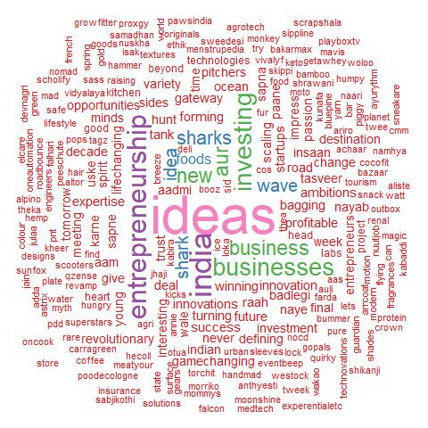

```{r setup, include=FALSE}
knitr::opts_chunk$set(echo = TRUE)
```


# Dataset Link https://www.kaggle.com/datasets/thirumani/shark-tank-india
# Importing and Installing Required Libraries


```{r}
#install.packages("plotrix")
#install.packages("lessR")
#install.packages("car")

#install.packages("wordcloud")
#install.packages("wordcloud2")
#install.packages("RColorBrewer")
#install.packages("tm")
library(tm)
library("plotrix")
library(lessR)
library("car")
library(dplyr)
library(ggplot2)
library(ggpubr)
library(wordcloud)
library(RColorBrewer)
library(wordcloud2)
library(rmarkdown)
```

```{r}
theme_set(theme_pubr())
```


# Importing the Dataset

```{r}
data=read.csv("C:\\Users\\sarwe\\Desktop\\Tutorial\\SY\\SY-II\\DS\\Course Project\\Shark Tank India.csv")
```

# WordCloud
```{r}
text <- c(data$Episode.Title, data$Startup.Name)
docs <- Corpus(VectorSource(text))
```

```{r}
docs <- docs %>%
  tm_map(removeNumbers) %>%
  tm_map(removePunctuation) %>%
  tm_map(stripWhitespace)
docs <- tm_map(docs, content_transformer(tolower))
docs <- tm_map(docs, removeWords, stopwords("english"))
```

```{r}
dtm <- TermDocumentMatrix(docs)
matrix <- as.matrix(dtm) 
words <- sort(rowSums(matrix),decreasing=TRUE) 
df <- data.frame(word = names(words),freq=words)
```


```{r}
jpeg(file="wc.jpeg")
set.seed(2000) # for reproducibility 
wc <- wordcloud(words = df$word, freq = df$freq, min.freq = 1, max.words=300, random.order=FALSE, rot.per= 0.30, colors=brewer.pal(8, "Set1"), scale = c(5, 0.75))
dev.off()
```
{width=80%}
```{r}
brewer.pal.info
```
# Understanding the Data

## Data Summary

```{r}
head(data)
```

```{r}
dim(data)
```


```{r}
tail(data)
```

```{r}
summary(data)
```
## Removing Insignificant Column
```{r}
colnames(data)
data <- data[, -c(1)]
print("--------------------------------------------------------------------------------")
print("After removing Column")
print("--------------------------------------------------------------------------------")
colnames(data)
```

```{r}
#barplot(table(data$Industry))
pitches <- table(data$Industry)
pitches
```

## Number of Pitches according to Industry
```{r fig.align='center'}
plt <- barplot(as.numeric(pitches),
main = "Number of Pitches per Industry",
xlab = "Industries",
ylab = "Number of Pitches",
col = "darkred",
horiz = FALSE)
axis(1, at = plt, labels=names(pitches), cex.axis=0.4)
```


## Presenters Data
```{r fig.align='center'}
male_presenters <- sum(data$Male.Presenters,na.rm = TRUE)
female_presenters <- sum(data$Female.Presenters, na.rm = TRUE)
couple_presenters <- sum(data$Couple.Presenters, na.rm = TRUE)

barplot(c(male_presenters, female_presenters, couple_presenters),
        names.arg = c("Male", "Female", "Couples"),
        xlab = "Presenters",
        ylab = "Number of Pitches",
        col = "yellow",
        horiz = TRUE)
```

```{r fig.align='center'}
pie3D(c(male_presenters, female_presenters), labels = c("Male", "Female"), main = "Male vs Female Entreprenuers", explode = 0.1,col = c("yellow","skyblue"))
```

## Received Offers
```{r fig.align='center'}
PieChart(Received.Offer,hole = 0, values = "%", data = data,main = "Received and Not Received", fill = c("red", "green"))
```


```{r fig.align='center'}
PieChart(Accepted.Offer,hole = 0, values = "%", data = data,main = "Accepted the Received Offer", fill = c("red", "green"))
```

## Rejected Offers
```{r}
rejected_offers <- data.frame(data[data$Accepted.Offer == 0,c("Startup.Name", "Industry", "Original.Ask.Amount", "Original.Ask.Equity")])
rejected_offers <- na.exclude(rejected_offers)
rejected_offers
```

```{r}
rejected_offers_Industry <- data.frame(data[data$Accepted.Offer == 0,c("Industry")])
rejected_offers_Industry_count <- data.frame(table(rejected_offers_Industry))
rejected_offers_Industry_count
```
```{r fig.align='center'}
p<-ggplot(data=rejected_offers_Industry_count, aes(x=rejected_offers_Industry, y=Freq)) +
  geom_bar(stat="identity", fill="steelblue")+
  geom_text(aes(label=Freq), vjust=1.6, color="white", size=3.5)+
  theme_bw()+xlab("Rejected offeres according to industry")+ylab("Rejected Offers")
p
```


## Collecting Sharks data
```{r}
ashneer <- data[(!is.na(data$Ashneer.Investment.Amount) & data$Ashneer.Investment.Amount != 0 ),c("Startup.Name","Ashneer.Investment.Amount","Ashneer.Investment.Equity","Industry","Number.of.sharks.in.deal")]
namita <- data[!is.na(data$Namita.Investment.Amount) & data$Namita.Investment.Amount != 0 ,c("Startup.Name","Namita.Investment.Amount","Namita.Investment.Equity", "Industry","Number.of.sharks.in.deal")]
anupam <- data[!is.na(data$Anupam.Investment.Amount) & data$Anupam.Investment.Amount != 0 ,c("Startup.Name","Anupam.Investment.Amount","Anupam.Investment.Equity", "Industry", "Number.of.sharks.in.deal")]
vineeta <- data[!is.na(data$Vineeta.Investment.Amount) & data$Vineeta.Investment.Amount != 0 ,c("Startup.Name","Vineeta.Investment.Amount","Vineeta.Investment.Equity", "Industry", "Number.of.sharks.in.deal")]
aman <- data[!is.na(data$Aman.Investment.Amount) & data$Aman.Investment.Amount != 0 ,c("Startup.Name","Aman.Investment.Amount","Aman.Investment.Equity", "Industry","Number.of.sharks.in.deal")]
peyush <- data[!is.na(data$Peyush.Investment.Amount) & data$Peyush.Investment.Amount != 0 ,c("Startup.Name","Peyush.Investment.Amount","Peyush.Investment.Equity", "Industry", "Number.of.sharks.in.deal")]
ghazal <- data[!is.na(data$Ghazal.Investment.Amount) & data$Ghazal.Investment.Amount != 0 ,c("Startup.Name","Ghazal.Investment.Amount","Ghazal.Investment.Equity", "Industry", "Number.of.sharks.in.deal")]
```


## Investment Done by Sharks
```{r}
sharks <- c("Ashneer", "Namita", "Anupam", "Vineeta", "Aman", "Peyush", "Ghazal")
all <- data.frame(Sharks = sharks,Investments = c(length(ashneer$Ashneer.Investment.Amount), length(namita$Namita.Investment.Amount), length(anupam$Anupam.Investment.Amount), length(vineeta$Vineeta.Investment.Amount), length(aman$Aman.Investment.Amount), length(peyush$Peyush.Investment.Amount), length(ghazal$Ghazal.Investment.Amount)))
all
```
```{r fig.align='center'}
p<-ggplot(data=all, aes(x=Sharks, y=Investments)) +
  geom_bar(stat="identity", fill="steelblue")+
  geom_text(aes(label=all$Investments), vjust=1.6, color="white", size=3.5)+
  theme_bw()
p
```

## Amount Invested
```{r}
startup_count <- c(sum(ashneer$Ashneer.Investment.Amount),  sum(namita$Namita.Investment.Amount), sum(anupam$Anupam.Investment.Amount), sum(vineeta$Vineeta.Investment.Amount), sum(aman$Aman.Investment.Amount), sum(peyush$Peyush.Investment.Amount),sum(ghazal$Ghazal.Investment.Amount))
startup_count <- round(startup_count,2)
startup_count <- data.frame(Sharks = sharks, Count = startup_count)
startup_count
```
```{r fig.align='center'}
p<-ggplot(data=startup_count, aes(x=Sharks, y=Count)) +
  geom_bar(stat="identity", fill="steelblue")+
  geom_text(aes(label=Count), vjust=1.6, color="white", size=3.5)+theme_bw()+ylab("Amount")
p
```

## Equity Invested
```{r}
ashneer_equity <- sum(data[!is.na(data$Ashneer.Investment.Equity) & data$Ashneer.Investment.Equity != 0 ,"Ashneer.Investment.Equity"])
namita_equity <- sum(data[!is.na(data$Namita.Investment.Equity) & data$Namita.Investment.Equity != 0 ,"Namita.Investment.Equity"])
anupam_equity <- sum(data[!is.na(data$Anupam.Investment.Equity) & data$Anupam.Investment.Equity != 0 ,"Anupam.Investment.Equity"])
vineeta_equity <- sum(data[!is.na(data$Vineeta.Investment.Equity) & data$Vineeta.Investment.Equity != 0 ,"Vineeta.Investment.Equity"])
aman_equity <- sum(data[!is.na(data$Aman.Investment.Equity) & data$Aman.Investment.Equity != 0 ,"Aman.Investment.Equity"])
peyush_equity <- sum(data[!is.na(data$Peyush.Investment.Equity) & data$Peyush.Investment.Equity != 0 ,"Peyush.Investment.Equity"])
ghazal_equity <- sum(data[!is.na(data$Ghazal.Investment.Equity) & data$Ghazal.Investment.Equity != 0 ,"Ghazal.Investment.Equity"])

equity <- data.frame(Sharks=sharks, Equity=c(ashneer_equity, namita_equity, anupam_equity, vineeta_equity, aman_equity, peyush_equity, ghazal_equity))
equity
```

```{r fig.align='center'}
p<-ggplot(data=equity, aes(x=Sharks, y=Equity)) +
  geom_bar(stat="identity", fill="steelblue")+
  geom_text(aes(label=Equity), vjust=1.6, color="white", size=3.5)+theme_bw()
p
```


## Debt Given
```{r fig.align='center'}
ashneer_debt <- sum(data[!is.na(data$Ashneer.Debt.Amount) & data$Ashneer.Debt.Amount != 0 ,"Ashneer.Debt.Amount"])
namita_debt <- sum(data[!is.na(data$Namita.Debt.Amount) & data$Namita.Debt.Amount != 0 ,"Namita.Debt.Amount"])
anupam_debt <- sum(data[!is.na(data$Anupam.Debt.Amount) & data$Anupam.Debt.Amount != 0 ,"Anupam.Debt.Amount"])
vineeta_debt <- sum(data[!is.na(data$Vineeta.Debt.Amount) & data$Vineeta.Debt.Amount != 0 ,"Vineeta.Debt.Amount"])
aman_debt <- sum(data[!is.na(data$Aman.Debt.Amount) & data$Aman.Debt.Amount != 0 ,"Aman.Debt.Amount"])
peyush_debt <- sum(data[!is.na(data$Peyush.Debt.Amount) & data$Peyush.Debt.Amount != 0 ,"Peyush.Debt.Amount"])
ghazal_debt <- sum(data[!is.na(data$Ghazal.Debt.Amount) & data$Ghazal.Debt.Amount != 0 ,"Ghazal.Debt.Amount"])

debt <- data.frame(Sharks=sharks, Debt=c(ashneer_debt, namita_debt, anupam_debt, vineeta_debt, aman_debt, peyush_debt, ghazal_debt))
p<-ggplot(data=debt, aes(x=Sharks, y=Debt)) +
  geom_bar(stat="identity", fill="steelblue")+
  geom_text(aes(label=Debt), vjust=1.6, color="white", size=3.5)+theme_bw()
p
```
```{r}
DealDone <- data.frame(data[!is.na(data$Accepted.Offer) & data$Accepted.Offer == 1, c("Total.Deal.Amount", "Total.Deal.Equity")])
DealDone
```

## Deal Amount vs Equity
```{r fig.align='center'}
sp <- ggplot(DealDone, aes(x=Total.Deal.Equity, y=Total.Deal.Amount)) +
  geom_point()+xlab("Total Equity")+ylab("Amount")
sp + geom_density_2d()+xlab("Total Equity")+ylab("Amount")
sp + stat_density_2d(aes(fill = ..level..), geom="polygon")
sp + stat_density_2d(aes(fill = ..level..), geom="polygon")+
  scale_fill_gradient(low="blue", high="red")+xlab("Total Equity")+ylab("Amount")
```

## Top Start-Up by Deal Amount
```{r}
data_sorted <- data.frame(data[order(data$Total.Deal.Amount,
                                decreasing = TRUE), c("Startup.Name","Total.Deal.Amount")])

data_sorted <- head(data_sorted, 10)
data_sorted
```


```{r fig.align='center'}
ggplot(data_sorted, aes(x= Startup.Name, y=Total.Deal.Amount)) +
    geom_segment( aes(xend=Startup.Name, yend=0)) +
    geom_point( size=4, color="orange") +
    coord_flip() +
    theme_bw() +
    xlab("Top 10 Startups")+ylab("Total Deal Amount")
```


## Top Start-Ups by Equity
```{r}
data_sorted_equity <- data.frame(data[order(data$Total.Deal.Equity,
                                decreasing = TRUE), c("Startup.Name","Total.Deal.Equity")])

data_sorted_equity <- head(data_sorted_equity, 10)
data_sorted_equity
```
```{r fig.align='center'}
ggplot(data_sorted_equity, aes(x= Startup.Name, y=Total.Deal.Equity)) +
    geom_segment( aes(xend=Startup.Name, yend=0)) +
    geom_point( size=4, color="skyblue") +
    coord_flip() +
    theme_bw() +
    xlab("Top 10 Startups")+ylab("Total Deal Equity")
```

## Total Start-Ups by Debt
```{r}
data_sorted_debt <- data.frame(data[order(data$Total.Deal.Debt,
                                decreasing = TRUE), c("Startup.Name","Total.Deal.Debt")])

data_sorted_debt <- head(data_sorted_debt, 9)
data_sorted_debt
```
```{r fig.align='center'}
ggplot(data_sorted_debt, aes(x= Startup.Name, y=Total.Deal.Debt)) +
    geom_segment( aes(xend=Startup.Name, yend=0)) +
    geom_point( size=4, color="Yellow") +
    coord_flip() +
    theme_bw() +
    xlab("Top 10 Startups")+ylab("Total Deal Debt")
```

# Individual Shark Wise Data Analysis

## Ashneer's Investment
```{r fig.height=20}
ashneer <- Sort(data=ashneer, by = Ashneer.Investment.Amount)

aamount<-ggplot(data=ashneer, aes(x=Ashneer.Investment.Amount, y=Startup.Name)) +
  geom_bar(stat="identity", fill="steelblue")+
  geom_text(aes(label=Ashneer.Investment.Amount), vjust=0.5,hjust=0,color="black", size=3)+theme_bw()

aequity <- ggplot(data=ashneer, aes(x=Ashneer.Investment.Equity, y=Startup.Name)) +
  geom_bar(stat="identity", fill="steelblue")+
  geom_text(aes(label=Ashneer.Investment.Equity), vjust=0.5,hjust=0,color="black", size=3)+theme_bw()

ashnner_indus_details <- data.frame(table(ashneer$Industry))
ashneer_indus <- ggplot(ashnner_indus_details, aes(x="", y=Freq, fill=Var1)) +
  geom_bar(stat="identity", width=1, color="white")+
  coord_polar("y", start=0)+theme_void()

asharksNo <- ggplot(data=ashneer, aes(x=Number.of.sharks.in.deal, y=Startup.Name)) +
  geom_bar(stat="identity", fill="steelblue")+
  geom_text(aes(label=Number.of.sharks.in.deal), vjust=0.5,hjust=0,color="black", size=3)+theme_bw()

ashneerfig<-ggarrange(aamount,aequity, ashneer_indus,asharksNo,
                    labels = c("Amount", "Equity","Inudstries"),
                    ncol = 2, nrow = 2)

```
```{r fig.width=10, fig.align='center'}
aamount+ggtitle("Amount Invested by Ashneer")+xlab("Amount")+ylab("Startup Name")
```
```{r fig.width=10, fig.align='center'}
aequity+ggtitle("Equity Invested by Ashneer")+xlab("Equity")+ylab("Startup Name")
```
```{r fig.align='center'}
ashneer_indus+ggtitle("Industry wise investment")
```

```{r fig.width=10, fig.align='center'}
asharksNo+ggtitle("Sharks in a deal with Ashneer")+xlab("Sharks")+ylab("Startup Name")
```

## Namita's Investment
```{r fig.height=20}
namita <- Sort(data=namita, by = Namita.Investment.Amount)

namount<-ggplot(data=namita, aes(x=Namita.Investment.Amount, y=Startup.Name)) +
  geom_bar(stat="identity", fill="steelblue")+
  geom_text(aes(label=Namita.Investment.Amount), vjust=0.5,hjust=0,color="black", size=3)+theme_bw()

nequity <- ggplot(data=namita, aes(x=Namita.Investment.Equity, y=Startup.Name)) +
  geom_bar(stat="identity", fill="steelblue")+
  geom_text(aes(label=Namita.Investment.Equity), vjust=0.5,hjust=0,color="black", size=3)+theme_bw()

nsharksNo <- ggplot(data=namita, aes(x=Number.of.sharks.in.deal, y=Startup.Name)) +
  geom_bar(stat="identity", fill="steelblue")+
  geom_text(aes(label=Number.of.sharks.in.deal), vjust=0.5,hjust=0,color="black", size=3)+theme_bw()

#ashneer_pie <- PieChart(Industry,hole = 0, values = "%", data = ashneer, main = "Accepted the Received Offer", fill = brewer.pal(8,"Set1"))
namita_indus_details <- data.frame(table(namita$Industry))
namita_indus <- ggplot(namita_indus_details, aes(x="", y=Freq, fill=Var1)) +
  geom_bar(stat="identity", width=1, color="white")+
  coord_polar("y", start=0)+theme_void()
namitafig<-ggarrange(namount, nequity, namita_indus,nsharksNo,
                    labels = c("Amount", "Equity","Inudstries"),
                    ncol = 2, nrow = 2)
#fig
```

```{r fig.width=10, fig.align='center'}
namount+ggtitle("Amount Invested by Namita")+xlab("Amount")+ylab("Startup Name")
```

```{r fig.width=10, fig.align='center'}
nequity+ggtitle("Equity Invested by Namita")+xlab("Equity")+ylab("Startup Name")
```

```{r fig.align='center'}
namita_indus+ggtitle("Industry wise investment")+xlab("Equity")+ylab("Startup Name")
```


```{r fig.width=10, fig.align='center'}
nsharksNo+ggtitle("Sharks in deal with Namita")+xlab("Sharks")+ylab("Startup Name")
```


## Peyush's Investment
```{r}
peyush <- Sort(data=peyush, by = Peyush.Investment.Amount)

pamount<-ggplot(data=peyush, aes(x=Peyush.Investment.Amount, y=Startup.Name)) +
  geom_bar(stat="identity", fill="steelblue")+
  geom_text(aes(label=Peyush.Investment.Amount), vjust=0.5,hjust=0,color="black", size=3)+theme_bw()

pequity <- ggplot(data=peyush, aes(x=Peyush.Investment.Equity, y=Startup.Name)) +
  geom_bar(stat="identity", fill="steelblue")+
  geom_text(aes(label=Peyush.Investment.Equity), vjust=0.5,hjust=0,color="black", size=3)+theme_bw()

peyush_indus_details <- data.frame(table(peyush$Industry))
peyush_indus <- ggplot(peyush_indus_details, aes(x="", y=Freq, fill=Var1)) +
  geom_bar(stat="identity", width=1, color="white")+
  coord_polar("y", start=0)+theme_void()

psharksNo <- ggplot(data=peyush, aes(x=Number.of.sharks.in.deal, y=Startup.Name)) +
  geom_bar(stat="identity", fill="steelblue")+
  geom_text(aes(label=Number.of.sharks.in.deal), vjust=0.5,hjust=0,color="black", size=3)+theme_bw()

peyushfig<-ggarrange(pamount, pequity, peyush_indus, psharksNo,
                    labels = c("Amount", "Equity","Inudstries"),
                    ncol = 1, nrow = 3)
#fig
```

```{r fig.width=10, fig.align='center'}
pamount+ggtitle("Amount Invested by Peyush")+xlab("Amount")+ylab("Startup Name")
```

```{r fig.width=10, fig.align='center'}
pequity+ggtitle("Equity Invested by Peyush")+xlab("Equity")+ylab("Startup Name")
```
```{r fig.align='center'}
peyush_indus+ggtitle("Industry wise Investment")
```
```{r fig.width=10, fig.align='center'}
psharksNo+ggtitle("Sharks in a deal with Peyush")+xlab("Sharks")+ylab("Startup Name")
```


## Anupam's Investment
```{r}
anupam <- Sort(data=anupam, by = Anupam.Investment.Amount)

anupamount<-ggplot(data=anupam, aes(x=Anupam.Investment.Amount, y=Startup.Name)) +
  geom_bar(stat="identity", fill="steelblue")+
  geom_text(aes(label=Anupam.Investment.Amount), vjust=0.5,hjust=0,color="black", size=3)+theme_bw()

anupequity <- ggplot(data=anupam, aes(x=Anupam.Investment.Equity, y=Startup.Name)) +
  geom_bar(stat="identity", fill="steelblue")+
  geom_text(aes(label=Anupam.Investment.Equity), vjust=0.5,hjust=0,color="black", size=3)+theme_bw()

anup_indus_details <- data.frame(table(anupam$Industry))
anup_indus <- ggplot(anup_indus_details, aes(x="", y=Freq, fill=Var1)) +
  geom_bar(stat="identity", width=1, color="white")+
  coord_polar("y", start=0)+theme_void()

anupsharksNo <- ggplot(data=anupam, aes(x=Number.of.sharks.in.deal, y=Startup.Name)) +
  geom_bar(stat="identity", fill="steelblue")+
  geom_text(aes(label=Number.of.sharks.in.deal), vjust=0.5,hjust=0,color="black", size=3)+theme_bw()

anupamfig<-ggarrange(anupamount, anupequity, anup_indus, anupsharksNo,
                    labels = c("Amount", "Equity","Inudstries"),
                    ncol = 2, nrow = 2)
#anupamfig
```
```{r fig.width=10, fig.align='center'}
anupamount+ggtitle("Amount Invested by Anupam")+xlab("Amount")+ylab("Startup Name")
```

```{r fig.width=10, fig.align='center'}
anupequity+ggtitle("Equity Invested by Anupam")+xlab("Equity")+ylab("Startup Name")
```

```{r fig.align='center'}
anup_indus+ggtitle("Industry wise investment")
```

```{r fig.width=10, fig.align='center'}
anupsharksNo+ggtitle("Number of sharks in a deal with Anupam")+xlab("Number of Sharks")+ylab("Startup Name")
```

## Vineets's Investment
```{r}
vineeta <- Sort(data=vineeta, by = Vineeta.Investment.Amount)
vamount<-ggplot(data=vineeta, aes(x=Vineeta.Investment.Amount, y=Startup.Name)) +
  geom_bar(stat="identity", fill="steelblue")+
  geom_text(aes(label=Vineeta.Investment.Amount), vjust=0.5,hjust=0,color="black", size=3)+theme_bw()

vequity <- ggplot(data=vineeta, aes(x=Vineeta.Investment.Equity, y=Startup.Name)) +
  geom_bar(stat="identity", fill="steelblue")+
  geom_text(aes(label=Vineeta.Investment.Equity), vjust=0.5,hjust=0,color="black", size=3)+theme_bw()

vineeta_indus_details <- data.frame(table(vineeta$Industry))
vineeta_indus <- ggplot(vineeta_indus_details, aes(x="", y=Freq, fill=Var1)) +
  geom_bar(stat="identity", width=1, color="white")+
  coord_polar("y", start=0)+theme_void()

vsharksNo <- ggplot(data=vineeta, aes(x=Number.of.sharks.in.deal, y=Startup.Name)) +
  geom_bar(stat="identity", fill="steelblue")+
  geom_text(aes(label=Number.of.sharks.in.deal), vjust=0.5,hjust=0,color="black", size=3)+theme_bw()

vineetafig<-ggarrange(vamount, vequity, vineeta_indus, vsharksNo,
                    labels = c("Amount", "Equity","Inudstries"),
                    ncol = 2, nrow = 2)
#anupamfig
```

```{r fig.align='center'}
vamount+ggtitle("Amount Invested by Vineeta")+xlab("Amount")+ylab("Startup Name")
```
```{r fig.align='center'}
vequity+ggtitle("Equity Invested by Vineeta")+xlab("Equity")+ylab("Startup Name")
```
```{r fig.align='center'}
vineeta_indus+ggtitle("Industry wise investment")
```
```{r fig.align='center'}
vsharksNo+ggtitle("Number of sharks in a deal with Vineeta")+xlab("Number of Sharks")+ylab("Startup Name")
```


## Ghazal's Investment
```{r}
ghazal <- Sort(data=ghazal, by = Ghazal.Investment.Amount)
gamount<-ggplot(data=ghazal, aes(x=Ghazal.Investment.Amount, y=Startup.Name)) +
  geom_bar(stat="identity", fill="steelblue")+
  geom_text(aes(label=Ghazal.Investment.Amount), vjust=0.5,hjust=0,color="black", size=3)+theme_bw()

gequity <- ggplot(data=ghazal, aes(x=Ghazal.Investment.Equity, y=Startup.Name)) +
  geom_bar(stat="identity", fill="steelblue")+
  geom_text(aes(label=Ghazal.Investment.Equity), vjust=0.5,hjust=0,color="black", size=3)+theme_bw()

ghazal_indus_details <- data.frame(table(ghazal$Industry))
ghazal_indus <- ggplot(ghazal_indus_details, aes(x="", y=Freq, fill=Var1)) +
  geom_bar(stat="identity", width=1, color="white")+
  coord_polar("y", start=0)+theme_void()

gsharksNo <- ggplot(data=ghazal, aes(x=Number.of.sharks.in.deal, y=Startup.Name)) +
  geom_bar(stat="identity", fill="steelblue")+
  geom_text(aes(label=Number.of.sharks.in.deal), vjust=0.5,hjust=0,color="black", size=3)+theme_bw()

ghazalfig<-ggarrange(gamount, gequity, ghazal_indus, gsharksNo,
                    labels = c("Amount", "Equity","Inudstries"),
                    ncol = 2, nrow = 2)
#anupamfig
```

```{r fig.align='center'}
gamount+ggtitle("Amount Invested by Ghazal")+xlab("Amount")+ylab("Startup Name")
```

```{r fig.align='center'}
gequity+ggtitle("Equity Invested by Ghazal")+xlab("Equity")+ylab("Startup Name")
```

```{r fig.align='center'}
ghazal_indus+ggtitle("Industry wise investment")
```

```{r fig.align='center'}
gsharksNo+ggtitle("Number of sharks in a deal with Ghazal")+xlab("Number of Sharks")+ylab("Startup Name")
```

# Revenue Analysis

```{r}
revenue <- data[c("Startup.Name","Yearly.Revenue")]
```

```{r}
revenue <- Sort(data=revenue, by = Yearly.Revenue, direction = "-")
revenue <- head(revenue, 10)
```

```{r fig.width= 10, fig.align='center'}
ggplot(data=revenue, aes(x=Startup.Name, y=Yearly.Revenue)) +
  geom_bar(stat="identity", fill="steelblue")+
  geom_text(aes(label=Yearly.Revenue), vjust=1.6, color="white", size=3.5)+xlab("Startup Name")+ylab("Yearly Revenue")+ggtitle("Top Startups According to Revenue")+theme_bw()
```

```{r}
revenue2 <- na.exclude(data.frame(data[data$Accepted.Offer != 0,c("Startup.Name", "Yearly.Revenue")]))
revenue2
```


```{r}
revenue2 <- Sort(data=revenue2, by = Yearly.Revenue, direction = "-")
revenue2 <- head(revenue2, 10)
revenue2
```
```{r fig.width=10, fig.align='center'}
ggplot(data=revenue2, aes(x=Startup.Name, y=Yearly.Revenue)) +
  geom_bar(stat="identity", fill="steelblue")+
  geom_text(aes(label=Yearly.Revenue), vjust=1.6, color="white", size=3.5)+xlab("Startup Name")+ylab("Yearly Revenue")+ggtitle("Top Startups According to Revenue who Received Offer")+theme_bw()
```


# Age of Startups
```{r}
started_in <- data[c("Startup.Name", "Started.in")]
started_in["Age"] <- 2022 - started_in$Started.in
```

```{r}
started_in
```


```{r}
started_in <- Sort(data=started_in, by = Age, direction = "-")
started_in <- head(started_in, 10)
```

```{r fig.width=10, fig.align='center'}
ggplot(data=started_in, aes(x=Startup.Name, y=Age)) +
  geom_bar(stat="identity", fill="steelblue")+
  geom_text(aes(label=Started.in), vjust=1.6, color="white", size=3.5)+xlab("Startup Name")+ylab("Age")+ggtitle("Most old startups")+theme_bw()
```

```{r}
city <- data.frame(table(data[data$Pitchers.City != "", "Pitchers.City"]))
city <- head(Sort(data=city, by = Freq, direction = "-"), 10)
city
```


```{r fig.width=10, fig.align='center'}
ggplot(data=city, aes(x=Var1, y=Freq)) +
  geom_bar(stat="identity", fill="steelblue")+
  geom_text(aes(label=Freq), vjust=1.6, color="white", size=3.5)+xlab("City Name")+ylab("Number of Pitchers")+ggtitle("City analysis of pitchers")+theme_bw()
```

```{r}
cityXoffers <- data.frame(table(data[(data$Pitchers.City != "" && data$Received.Offer != 0), "Pitchers.City"]))
cityXoffers <- head(Sort(data=cityXoffers[cityXoffers$Var1 != "",], by = Freq, direction = "-"), 10)
cityXoffers
```
```{r fig.width=10, fig.align='center'}
ggplot(data=cityXoffers, aes(x=Var1, y=Freq)) +
  geom_bar(stat="identity", fill="steelblue")+
  geom_text(aes(label=Freq), vjust=1.6, color="white", size=3.5)+xlab("City Name")+ylab("Offers Received")+ggtitle("City X Offers Received")+theme_bw()
```

<center> <h1>THANK YOU</h1> </center>

<center>{width=80%} </center>


